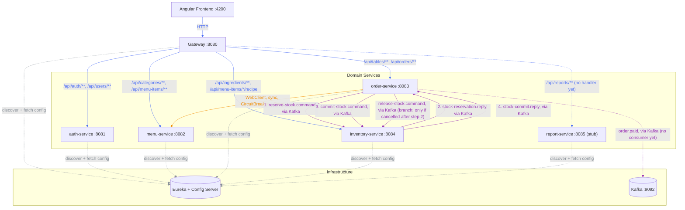
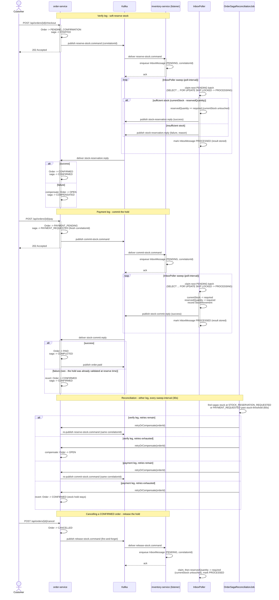
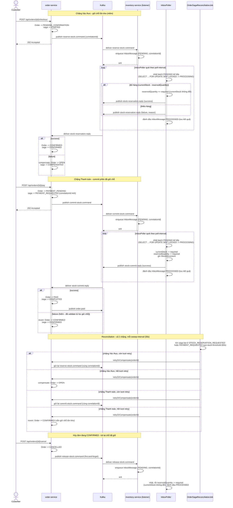

# Cafe Management System

🇬🇧 English is expanded by default below — 🇻🇳 nhấn vào phần "Tiếng Việt" bên dưới để mở nội dung tiếng Việt.

<details open>
<summary><strong>🇬🇧 English</strong></summary>

Cafe management web app — microservices architecture (Spring Boot + Angular + PostgreSQL + Kafka), built primarily as a learning project for canonical microservice patterns rather than to optimize for the shortest path to a working app.

See the implementation plan for the full design (domain model, service boundaries, checkout saga, routing, docker-compose).

## Services

| Service | Port | Responsibility |
|---|---|---|
| eureka-server | 8761 | Service discovery registry |
| config-server | 8888 | Centralized configuration (Spring Cloud Config, native profile) |
| gateway | 8080 | Single entry point for the frontend — routing, CORS, JWT verification |
| auth-service | 8081 | User accounts, login, JWT issuance |
| menu-service | 8082 | Categories & menu items |
| order-service | 8083 | Dining tables, orders, checkout saga orchestration |
| inventory-service | 8084 | Ingredients, stock levels, recipes, stock reservation (saga participant) |
| report-service | 8085 | Scaffolded module, not yet implemented |
| postgres | 5432 | One database (and one DB role) per service |
| kafka | 9092 / 9094 | Event backbone for the order↔inventory checkout saga |
| kafka-ui | 8090 | Web UI for inspecting Kafka topics |

Each of auth/menu/order/inventory-service exposes Swagger UI at `http://localhost:<port>/swagger-ui.html` for interactive API docs.

## Service communication



Edge color marks the kind of communication: 🟦 blue for gateway HTTP routing, 🟧 orange for the direct synchronous service-to-service call, 🟪 purple for Kafka messaging, and ⬜ grey for service discovery/config lookups. Solid arrows carry actual request/business traffic; dashed arrows are infrastructure plumbing or paths that exist but have no consumer/handler yet. Note that `order-service → menu-service` is a direct service-to-service call resolved via Eureka — it bypasses the gateway, since the gateway is only the entry point for frontend traffic. Kafka topics (`reserve-stock.command`, `stock-reservation.reply`, `commit-stock.command`, `stock-commit.reply`, `release-stock.command`, `order.paid`) are drawn as a single edge between publisher and consumer labeled with the topic name, rather than as separate producer→Kafka and Kafka→consumer hops — Kafka is still the broker underneath, this just keeps the diagram from having to route every topic through the `Kafka` node explicitly. The `1.`–`4.` prefixes on the order-service ↔ inventory-service edges are the order they fire in during a normal checkout-then-payment (this diagram is a static topology, not a timeline, so a plain edge can't otherwise convey that); `release-stock.command` is unnumbered since it's a separate branch, only published if a `CONFIRMED` order gets cancelled. For the full step-by-step, including every failure path, see [Business flow: checkout and payment saga](#business-flow-checkout-and-payment-saga) below.

## Business flow: checkout and payment saga

The topology diagram above shows *who talks to whom*; this shows the *order* the steps happen in, including every failure path. `order-service` runs this as an orchestrated state machine (not choreography) since stock handling is the only part that can fail and needs compensation — and it's now two separate saga legs, not one.

Stock is handled as a **soft reservation**, not a single deduction: verifying an order *holds* quantity (`Ingredient.reservedQuantity`) without touching `currentStock`; only paying actually deducts it. Availability for a new reservation is always `currentStock - reservedQuantity`, so two in-flight orders can never both claim the same physical stock.



Both legs fail the same two ways:

- **A reply arrives, but says no** — handled directly in the reply listener: `onStockReservationReply` compensates the verify leg back to `OPEN`; `onStockCommitReply` reverts the payment leg back to `CONFIRMED` (the stock hold is still legitimate — only the commit attempt failed, so there's nothing to re-verify, just retry payment).
- **No reply ever arrives** (inventory-service was down, the message was lost) — nothing in the request/reply exchange can detect this on its own. `OrderSagaReconciliationJob` now sweeps both legs (`STOCK_RESERVATION_REQUESTED` and `PAYMENT_REQUESTED`) past `stuck-threshold`, and `retryOrCompensate` branches on which leg it finds: the verify leg gives up to `OPEN` (nothing was ever held), the payment leg gives up to `CONFIRMED` (the hold stays — same reasoning as the reply-arrives-but-fails case).

Retrying either leg is safe to repeat because it re-publishes with the *same* `correlationId` for that leg (a fresh one is minted per leg via `OrderSagaStateService.start`/`startPaymentAttempt`): Kafka keys the message by `orderId`, so every attempt lands in the same partition and is processed in order by inventory-service, whose `inbox_messages` table is keyed on `correlationId` (the Transactional Inbox above) — a redelivery of an already-`PROCESSED` correlationId just gets the stored reply resent instead of the effect being applied twice. Cancelling a `CONFIRMED` order's release is deliberately **not** covered by reconciliation — it's fire-and-forget with no reply to watch, an accepted gap for now.

## Auth flow

1. Client logs in via `POST /api/auth/login` (public, no token required) — auth-service checks credentials and issues an RS256-signed JWT.
2. Every other request carries that JWT as `Authorization: Bearer <token>`.
3. The gateway's `JwtAuthGlobalFilter` is the only place that ever sees or verifies the JWT: it strips any `X-User-*` headers the client tried to set itself (so identity can't be spoofed), verifies the signature with auth-service's public key (fetched from config-server), and — only on success — sets trusted `X-User-Id` / `X-Username` / `X-User-Role` headers from the token's claims.
4. Downstream services never see the JWT; they trust the gateway's headers via `common-lib`'s `HeaderAuthenticationFilter`. A missing or invalid token gets a `401` at the gateway, before it ever reaches a domain service.

## Patterns in use

Since this project's purpose is to practice canonical patterns, worth calling out explicitly which ones are implemented so far:

- **Service Discovery** — Eureka (`eureka-server`)
- **API Gateway** — Spring Cloud Gateway, single entry point + CORS + routing
- **Externalized Configuration** — Spring Cloud Config Server, native profile backed by a bind-mounted `config-repo` (see below)
- **Trusted Header Authentication** — gateway validates the JWT once and forwards identity via `X-User-Id`/`X-Username`/`X-User-Role` headers; downstream services trust the gateway instead of re-validating (`common-lib`'s `TrustedHeaderAuth`)
- **Circuit Breaker + Retry** — Resilience4j on order-service's calls to menu-service
- **Orchestrated Saga** — order-service's checkout flow drives a state machine (`OrderCheckoutSaga`) with two legs: verify (soft-reserve stock, `OPEN`→`CONFIRMED`) and pay (commit the hold, `CONFIRMED`→`PAID`), each its own Kafka round trip that commits or compensates based on the reply; see [Business flow: checkout and payment saga](#business-flow-checkout-and-payment-saga)
- **Try-Confirm/Cancel-style stock reservation** — inventory-service never deducts `currentStock` directly from a checkout attempt. Verifying *tries* a hold (`reservedQuantity`), paying *confirms* it into a real deduction, cancelling a `CONFIRMED` order *cancels* the hold — the same three-step shape as the classic TCC pattern, layered on top of the saga above rather than replacing it
- **Transactional Inbox** — `StockReservationListener`'s three `@KafkaListener` methods no longer run business logic inline: each one only persists the incoming command into `inbox_messages` (status `PENDING`, keyed on `correlationId`) and acks. A separate scheduled worker, `InboxPoller`, claims a batch of `PENDING` rows (`SELECT ... FOR UPDATE SKIP LOCKED`, safe under concurrent pollers) and hands each to `InboxMessageProcessor`, which runs the actual `reserve`/`commit`/`release` step and marks the row `PROCESSED` atomically in one transaction, then publishes the reply (reserve/commit only — release has none). This is the asynchronous variant the project's earlier Idempotent Consumer explicitly wasn't yet — the mirror image of Transactional Outbox's relay, decoupling message receipt/ack from processing. `correlationId` stays the idempotency key: a redelivered command with an already-`PROCESSED` row gets the stored reply resent without re-running business logic (needed so `OrderSagaReconciliationJob`'s retry-with-same-`correlationId` still gets answered); one still `PENDING`/`PROCESSING`/`FAILED` is simply dropped, since it's already queued or was never a valid outcome to resend. A technical failure rolls that attempt's transaction back; in a separate transaction, the row either goes back to `PENDING` for another pass (up to `app.inbox.max-attempts`) or, once exhausted, `FAILED` permanently — silently, by design: `OrderSagaReconciliationJob`'s own stuck-saga sweep is the intended safety net for "no reply ever arrives," on either saga leg, regardless of cause
- **Reconciliation** — `OrderSagaReconciliationJob` sweeps sagas stuck waiting on a reply on *either* saga leg, and retries or compensates them to the right target state per leg (see the business flow above)
- **Dead Letter Queue** — inventory-service routes messages that fail for *technical* reasons at the Kafka-receipt layer (bad payload, bugs, DB errors — never a business "insufficient stock" outcome, which is a normal reply, not an exception) to a `.dlq` topic after a short exponential-backoff retry, instead of blocking the consumer on a poison-pill message. Applies uniformly to all three inventory command topics (`reserve-stock`, `commit-stock`, `release-stock`) via one shared error-handler bean, not configured per topic
- **Database per Service** — separate Postgres database and role per service

## Structure

```
backend/    Maven multi-module reactor: 5 domain services + gateway + eureka-server + config-server + common-lib
frontend/   Angular (standalone components)
docker/     Postgres init scripts
```

config-server's native config lives at `backend/config-server/src/main/resources/config-repo/`. It's bind-mounted read-only into the `config-server` container (see `docker-compose.yml`), so editing a `config-repo/*.yml` file only requires `docker compose restart config-server` (plus restarting whichever downstream service reads that config) — no image rebuild.

## Prerequisites

- Java 21
- Node.js 20+ (Angular 21 / npm 11)
- Docker & Docker Compose

## Running locally

```bash
docker-compose up -d
cd frontend && ng serve
```

Gateway (the single entry point for the frontend): http://localhost:8080
Eureka dashboard: http://localhost:8761
Kafka UI: http://localhost:8090

There's no self-registration flow — staff accounts are provisioned by an ADMIN. On first boot, auth-service auto-seeds a default admin account (`admin` / `admin123`) if the `users` table is empty, so you have something to log in with. It's dev-only; a real deployment should seed its first admin out-of-band instead. Roles are `ADMIN` and `CASHIER`.

## Testing

Frontend unit tests run on Angular's Vitest-based test builder:

```bash
cd frontend
npm test               # watch mode
npm run test:coverage  # single run, with an HTML coverage report
```

`test:coverage` writes a drill-down report to `frontend/coverage/frontend/index.html` — open it in a browser to see coverage per folder, then per file, then per line (folders/files are clickable, uncovered lines are highlighted red). Project convention: every new or modified component gets unit tests reaching at least 70% coverage before the work is considered done.

Backend unit tests run per-module with Maven (JUnit 5 + Mockito):

```bash
cd backend
mvn -pl inventory-service -am test
```

Modules that opt into the `jacoco-maven-plugin` (declared once in the parent `pom.xml`'s `pluginManagement`; so far only `inventory-service` activates it) write a drill-down HTML coverage report on every `mvn test` run, at `<module>/target/site/jacoco/index.html` — e.g. `backend/inventory-service/target/site/jacoco/index.html`. It's a plain static file, not served by anything: open it as a `file://` URL, e.g. `file:///<path-to-repo>/backend/inventory-service/target/site/jacoco/index.html` (substitute your own absolute repo path), or just double-click the file. You'll see coverage per package, then per class, then per line (same drill-down shape as the frontend's report; uncovered lines are highlighted red). To check a different module once it opts in, swap the `-pl` module name and the path accordingly. Backend test coverage is being built out module by module rather than all at once; check the codebase for current status instead of treating this README as the tracker.

## Troubleshooting

- **Gateway returns 503 right after restarting a service** — Spring Cloud Gateway's load balancer keeps a short-lived cache of service instances resolved via Eureka; it can go stale for a few seconds after a restart. Retry after ~5s before assuming something's actually broken.
- **Docker build cache eating disk space** — repeated `docker compose build` during iterative development leaves old image layers behind indefinitely. Run `docker builder prune -f` periodically to reclaim space, or `docker system df` to check what's actually using it.
- **A service can't reach another (Eureka lookups hang or 500) when you run one bare from an IDE alongside the rest in Docker** — every service's `eureka.instance.hostname` defaults to `host.docker.internal` rather than its auto-detected host IP, because on Windows that auto-detected IP can land on a virtual adapter (VPN/WSL/Hyper-V) that Docker containers can't route to. `host.docker.internal` works both directions — Docker Desktop hairpins a container's own published port back through it, so containers and bare-host processes can reach each other through it uniformly. Fully-dockerized services can instead register by container IP (`docker-compose.yml` sets `EUREKA_INSTANCE_PREFER_IP_ADDRESS=true` for order-service), which is simpler when nothing runs bare.

</details>

<details>
<summary><strong>🇻🇳 Tiếng Việt</strong></summary>

Ứng dụng quản lý quán cà phê — kiến trúc microservices (Spring Boot + Angular + PostgreSQL + Kafka), được xây dựng chủ yếu như một dự án học tập các pattern microservice kinh điển, thay vì để tối ưu cho việc có ứng dụng chạy được nhanh nhất.

Xem file kế hoạch triển khai để biết đầy đủ thiết kế (domain model, ranh giới giữa các service, checkout saga, routing, docker-compose).

## Các service

| Service | Port | Trách nhiệm |
|---|---|---|
| eureka-server | 8761 | Registry cho service discovery |
| config-server | 8888 | Cấu hình tập trung (Spring Cloud Config, profile native) |
| gateway | 8080 | Cổng vào duy nhất cho frontend — routing, CORS, xác thực JWT |
| auth-service | 8081 | Tài khoản người dùng, đăng nhập, cấp JWT |
| menu-service | 8082 | Danh mục & món trong menu |
| order-service | 8083 | Bàn ăn, đơn hàng, điều phối checkout saga |
| inventory-service | 8084 | Nguyên liệu, tồn kho, công thức, giữ chỗ tồn kho (thành viên saga) |
| report-service | 8085 | Module mới scaffold, chưa triển khai |
| postgres | 5432 | Mỗi service có 1 database (và 1 role DB) riêng |
| kafka | 9092 / 9094 | Event backbone cho checkout saga giữa order↔inventory |
| kafka-ui | 8090 | Giao diện web để xem các Kafka topic |

Mỗi service trong số auth/menu/order/inventory-service đều expose Swagger UI tại `http://localhost:<port>/swagger-ui.html` để xem tài liệu API tương tác.

## Giao tiếp giữa các service


Màu của đường nối thể hiện loại giao tiếp: 🟦 xanh dương là routing HTTP qua gateway, 🟧 cam là lời gọi đồng bộ trực tiếp giữa 2 service, 🟪 tím là giao tiếp qua Kafka, và ⬜ xám là tra cứu service discovery/config. Đường liền là traffic nghiệp vụ thật; đường đứt là hạ tầng nền (infra plumbing) hoặc đường đi tồn tại nhưng chưa có consumer/handler xử lý. Lưu ý `order-service → menu-service` là lời gọi trực tiếp giữa 2 service, được phân giải qua Eureka — không đi qua gateway, vì gateway chỉ là cổng vào cho traffic từ frontend. Các topic Kafka (`reserve-stock.command`, `stock-reservation.reply`, `commit-stock.command`, `stock-commit.reply`, `release-stock.command`, `order.paid`) được vẽ thành 1 đường nối duy nhất giữa publisher và consumer, ghi tên topic ngay trên đó, thay vì tách thành 2 chặng producer→Kafka và Kafka→consumer riêng biệt — Kafka vẫn là broker đứng bên dưới, cách vẽ này chỉ để khỏi phải dẫn mọi topic qua node `Kafka` một cách tường minh. Số thứ tự `1.`–`4.` trên các cạnh giữa order-service ↔ inventory-service thể hiện đúng trình tự chúng xảy ra trong 1 lượt checkout-rồi-thanh-toán bình thường (sơ đồ này là topology tĩnh, không phải timeline, nên 1 cạnh trơn không tự nói lên được điều đó); `release-stock.command` không đánh số vì nó là 1 nhánh riêng, chỉ publish khi đơn đang `CONFIRMED` bị hủy. Muốn xem đầy đủ từng bước, kể cả mọi nhánh lỗi, xem mục "Luồng nghiệp vụ: saga xác thực và thanh toán" bên dưới.

## Luồng nghiệp vụ: saga xác thực và thanh toán

Biểu đồ topology ở trên cho biết *ai nói chuyện với ai*; còn biểu đồ này cho biết *thứ tự* các bước diễn ra, kể cả mọi đường đi khi thất bại. `order-service` chạy luồng này dưới dạng một state machine điều phối tập trung (orchestration, không phải choreography), vì phần xử lý tồn kho là phần duy nhất có thể thất bại và cần compensate — và giờ nó là **2 chặng saga riêng biệt**, không còn gộp làm 1.

Tồn kho được xử lý theo mô hình **giữ chỗ mềm (soft reservation)**, không trừ thẳng 1 lần: bước xác thực chỉ *giữ chỗ* số lượng (`Ingredient.reservedQuantity`), không đụng tới `currentStock`; chỉ khi thanh toán mới thực sự trừ. Số lượng khả dụng để giữ chỗ mới luôn là `currentStock - reservedQuantity`, nên 2 đơn đang xử lý cùng lúc không bao giờ giữ trùng cùng 1 phần tồn kho vật lý.



Cả 2 chặng đều xử lý 2 kiểu lỗi giống nhau:

- **Có reply trả về, nhưng báo thất bại** — xử lý trực tiếp trong listener nhận reply: `onStockReservationReply` compensate chặng Xác thực về `OPEN`; `onStockCommitReply` revert chặng Thanh toán về `CONFIRMED` (chỗ giữ tồn kho vẫn hợp lệ — chỉ có bước commit thất bại, nên không cần xác thực lại, chỉ cần thử thanh toán lại).
- **Không có reply nào trả về** (inventory-service bị down, message bị mất) — bản thân cơ chế request/reply không thể tự phát hiện trường hợp này. `OrderSagaReconciliationJob` giờ quét cả 2 chặng (`STOCK_RESERVATION_REQUESTED` và `PAYMENT_REQUESTED`) quá `stuck-threshold`, và `retryOrCompensate` rẽ nhánh theo đúng chặng đang kẹt: chặng Xác thực bỏ cuộc về `OPEN` (chưa từng giữ chỗ gì), chặng Thanh toán bỏ cuộc về `CONFIRMED` (vẫn giữ nguyên chỗ đã giữ — cùng logic như trường hợp reply báo lỗi ở trên).

Retry lại ở chặng nào cũng an toàn vì mỗi lần đều publish lại với *cùng* `correlationId` của chặng đó (mỗi chặng có 1 correlationId mới riêng, sinh ra qua `OrderSagaStateService.start`/`startPaymentAttempt`): Kafka key message theo `orderId`, nên mọi lần gửi đều rơi vào cùng 1 partition và được inventory-service xử lý tuần tự; bảng `inbox_messages` dùng `correlationId` làm khóa chính (chính là Transactional Inbox ở trên) — nên khi 1 correlationId đã `PROCESSED` bị gửi lại, nó chỉ nhận lại đúng reply đã lưu, thay vì hiệu ứng bị áp dụng 2 lần. Việc trả chỗ giữ khi hủy đơn `CONFIRMED` **cố tình không** được Reconciliation theo dõi — đây là fire-and-forget, không có reply để chờ, một khoảng trống được chấp nhận cho hiện tại.

## Luồng xác thực

1. Client đăng nhập qua `POST /api/auth/login` (public, không cần token) — auth-service kiểm tra thông tin đăng nhập và cấp JWT ký bằng RS256.
2. Mọi request sau đó đều mang JWT này qua header `Authorization: Bearer <token>`.
3. `JwtAuthGlobalFilter` ở gateway là nơi duy nhất từng thấy và xác thực JWT: nó xóa bỏ mọi header `X-User-*` mà client tự gửi lên (để không thể giả mạo danh tính), xác thực chữ ký bằng public key của auth-service (lấy từ config-server), và chỉ khi thành công mới set các header đáng tin cậy `X-User-Id`/`X-Username`/`X-User-Role` dựa trên claim trong token.
4. Các service phía sau không bao giờ thấy JWT; chúng tin tưởng header do gateway set, thông qua `HeaderAuthenticationFilter` trong `common-lib`. Token thiếu hoặc không hợp lệ sẽ bị trả về `401` ngay tại gateway, trước khi tới được bất kỳ service nghiệp vụ nào.

## Các pattern đã áp dụng

Vì mục đích của dự án là luyện tập các pattern kinh điển, nên liệt kê rõ những pattern nào đã được áp dụng tính tới thời điểm hiện tại:

- **Service Discovery** — Eureka (`eureka-server`)
- **API Gateway** — Spring Cloud Gateway, cổng vào duy nhất + CORS + routing
- **Externalized Configuration** — Spring Cloud Config Server, profile native được backing bởi `config-repo` bind-mount (xem phần bên dưới)
- **Trusted Header Authentication** — gateway xác thực JWT một lần duy nhất rồi chuyển tiếp danh tính qua header `X-User-Id`/`X-Username`/`X-User-Role`; các service phía sau tin tưởng gateway thay vì tự xác thực lại (`TrustedHeaderAuth` trong `common-lib`)
- **Circuit Breaker + Retry** — Resilience4j cho lời gọi từ order-service sang menu-service
- **Orchestrated Saga** — luồng checkout của order-service điều khiển một state machine (`OrderCheckoutSaga`) gồm 2 chặng: Xác thực (giữ chỗ mềm tồn kho, `OPEN`→`CONFIRMED`) và Thanh toán (commit chỗ đã giữ, `CONFIRMED`→`PAID`), mỗi chặng là 1 vòng round-trip Kafka riêng, tự commit hoặc compensate dựa theo reply nhận được; xem mục "Luồng nghiệp vụ: saga xác thực và thanh toán" bên trên
- **Giữ chỗ tồn kho kiểu Try-Confirm/Cancel (TCC)** — inventory-service không bao giờ trừ thẳng `currentStock` ngay khi checkout. Xác thực là bước *Try* (giữ chỗ vào `reservedQuantity`), thanh toán là bước *Confirm* (biến chỗ giữ thành trừ kho thật), hủy đơn `CONFIRMED` là bước *Cancel* (trả lại chỗ giữ) — đúng 3 bước kinh điển của pattern TCC, đặt chồng lên trên saga ở trên chứ không thay thế nó
- **Transactional Inbox** — 3 method `@KafkaListener` của `StockReservationListener` không còn chạy business logic ngay bên trong nữa: mỗi method chỉ lưu command nhận được vào bảng `inbox_messages` (status `PENDING`, khoá là `correlationId`) rồi ACK. Một worker chạy theo lịch riêng, `InboxPoller`, sẽ nhặt 1 batch dòng `PENDING` (`SELECT ... FOR UPDATE SKIP LOCKED`, an toàn khi có nhiều poller chạy đồng thời) và giao từng dòng cho `InboxMessageProcessor` — nơi thực sự chạy bước `reserve`/`commit`/`release` và đánh dấu dòng `PROCESSED` cùng lúc trong 1 transaction, rồi mới publish reply (chỉ reserve/commit — release thì không có reply). Đây chính là biến thể bất đồng bộ mà Idempotent Consumer trước đây của dự án còn thiếu — đối xứng ngược lại với relay của Transactional Outbox, tách rời việc nhận/ACK message khỏi việc xử lý. `correlationId` vẫn là khoá khử trùng lặp: 1 command bị gửi lại mà dòng tương ứng đã `PROCESSED` sẽ được gửi lại đúng reply đã lưu mà không chạy lại business logic (cần thiết để retry cùng `correlationId` của `OrderSagaReconciliationJob` vẫn được trả lời); còn dòng vẫn `PENDING`/`PROCESSING`/`FAILED` thì bị bỏ qua, vì đã đang được xếp hàng xử lý hoặc chưa từng có kết quả hợp lệ để gửi lại. Lỗi kỹ thuật khiến transaction của lần thử đó rollback; ở 1 transaction riêng, dòng được đưa lại `PENDING` để thử tiếp (tới `app.inbox.max-attempts` lần), hoặc khi hết lượt thì chuyển `FAILED` vĩnh viễn — im lặng, có chủ đích: sweep saga bị kẹt của `OrderSagaReconciliationJob` chính là lưới an toàn dành cho tình huống "không có reply nào tới", ở cả 2 chặng saga, bất kể nguyên nhân
- **Reconciliation** — `OrderSagaReconciliationJob` quét các saga bị kẹt khi chờ reply ở **cả 2 chặng**, rồi retry hoặc compensate về đúng trạng thái đích tương ứng từng chặng (xem luồng nghiệp vụ bên trên)
- **Dead Letter Queue** — inventory-service chuyển các message lỗi vì nguyên nhân *kỹ thuật* ở tầng nhận message từ Kafka (payload sai định dạng, bug, lỗi DB — không bao giờ tính trường hợp nghiệp vụ "hết hàng", vì đó là 1 reply bình thường, không phải exception) sang topic `.dlq` sau vài lần retry theo exponential backoff, thay vì để nó chặn cứng consumer (poison-pill message). Áp dụng đồng loạt cho cả 3 topic command của inventory (`reserve-stock`, `commit-stock`, `release-stock`) qua 1 bean xử lý lỗi dùng chung, không cấu hình riêng từng topic
- **Database per Service** — mỗi service có 1 database Postgres và 1 role riêng

## Cấu trúc

```
backend/    Maven multi-module reactor: 5 domain services + gateway + eureka-server + config-server + common-lib
frontend/   Angular (standalone components)
docker/     Script khởi tạo Postgres
```

Cấu hình native của config-server nằm ở `backend/config-server/src/main/resources/config-repo/`. Thư mục này được bind-mount dạng read-only vào container `config-server` (xem `docker-compose.yml`), nên sửa 1 file `config-repo/*.yml` chỉ cần `docker compose restart config-server` (và restart luôn service nào đang đọc config đó) — không cần rebuild lại image.

## Yêu cầu môi trường

- Java 21
- Node.js 20+ (Angular 21 / npm 11)
- Docker & Docker Compose

## Chạy ở local

```bash
docker-compose up -d
cd frontend && ng serve
```

Gateway (cổng vào duy nhất cho frontend): http://localhost:8080
Eureka dashboard: http://localhost:8761
Kafka UI: http://localhost:8090

Không có flow tự đăng ký — tài khoản nhân viên chỉ được tạo bởi ADMIN. Ở lần khởi động đầu tiên, auth-service tự động seed 1 tài khoản admin mặc định (`admin` / `admin123`) nếu bảng `users` đang rỗng, để có tài khoản đăng nhập ban đầu. Tài khoản này chỉ dùng cho dev; khi triển khai thật cần seed tài khoản admin đầu tiên theo cách khác (out-of-band). Có 2 role: `ADMIN` và `CASHIER`.

## Kiểm thử (Testing)

Unit test frontend chạy trên bộ test builder của Angular (nền tảng Vitest):

```bash
cd frontend
npm test               # chế độ watch
npm run test:coverage  # chạy 1 lần, kèm báo cáo coverage dạng HTML
```

`test:coverage` ghi ra báo cáo drill-down tại `frontend/coverage/frontend/index.html` — mở bằng trình duyệt để xem coverage theo từng thư mục, rồi từng file, rồi từng dòng code (thư mục/file có thể bấm vào, dòng chưa được test sẽ tô đỏ). Quy ước của dự án: mọi component có code mới hoặc sửa đổi đều cần unit test đạt tối thiểu 70% coverage trước khi coi là hoàn thành.

Unit test backend chạy theo từng module bằng Maven (JUnit 5 + Mockito):

```bash
cd backend
mvn -pl inventory-service -am test
```

Module nào bật `jacoco-maven-plugin` (khai báo 1 lần ở `pluginManagement` của `pom.xml` gốc; hiện chỉ `inventory-service` kích hoạt) sẽ ghi ra báo cáo coverage dạng HTML drill-down sau mỗi lần `mvn test`, tại `<module>/target/site/jacoco/index.html` — ví dụ `backend/inventory-service/target/site/jacoco/index.html`. Đây chỉ là file tĩnh, không có server nào phục vụ cả: mở dạng URL `file://`, ví dụ `file:///<đường-dẫn-repo>/backend/inventory-service/target/site/jacoco/index.html` (thay bằng đường dẫn tuyệt đối repo của bạn), hoặc double-click file đó cũng được. Bạn sẽ thấy coverage theo từng package, rồi từng class, rồi từng dòng code (cùng kiểu drill-down như báo cáo bên frontend; dòng chưa được test sẽ tô đỏ). Muốn xem module khác khi module đó bật jacoco, chỉ cần đổi tên module ở `-pl` và đường dẫn tương ứng. Coverage backend đang được xây dần từng module một chứ chưa phủ hết cùng lúc; xem trực tiếp codebase để biết tình trạng hiện tại thay vì coi README này là nơi theo dõi.

## Xử lý sự cố thường gặp

- **Gateway trả về 503 ngay sau khi restart 1 service** — load balancer của Spring Cloud Gateway giữ cache instance của service (phân giải qua Eureka) trong thời gian ngắn; cache này có thể bị stale vài giây sau khi restart. Thử lại sau ~5s trước khi kết luận là lỗi thật.
- **Docker build cache chiếm hết dung lượng ổ đĩa** — build đi build lại nhiều lần (`docker compose build`) trong lúc dev để lại các layer image cũ, không tự dọn. Chạy `docker builder prune -f` định kỳ để giải phóng dung lượng, hoặc `docker system df` để xem cái gì đang chiếm chỗ.
- **1 service không gọi được service khác (Eureka lookup treo hoặc trả 500) khi chạy 1 service bare từ IDE cùng lúc với phần còn lại đang chạy Docker** — `eureka.instance.hostname` của mỗi service mặc định là `host.docker.internal` thay vì IP tự nhận diện, vì trên Windows, IP tự nhận diện đó có thể rơi vào 1 virtual adapter (VPN/WSL/Hyper-V) mà container Docker không route tới được. `host.docker.internal` hoạt động theo cả 2 chiều — Docker Desktop "hairpin" cổng của chính container đó vòng qua host, nên cả container lẫn tiến trình chạy bare đều gọi được lẫn nhau qua đường này. Nếu mọi thứ đều chạy trong Docker (không có gì bare) thì có thể đăng ký thẳng bằng IP container cho đơn giản hơn (`docker-compose.yml` đã set `EUREKA_INSTANCE_PREFER_IP_ADDRESS=true` cho order-service).

</details>
