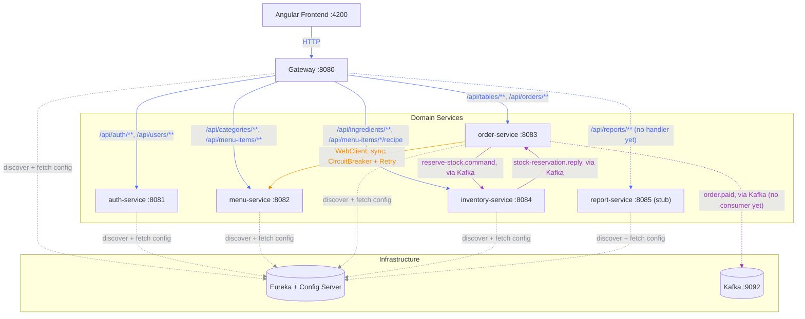
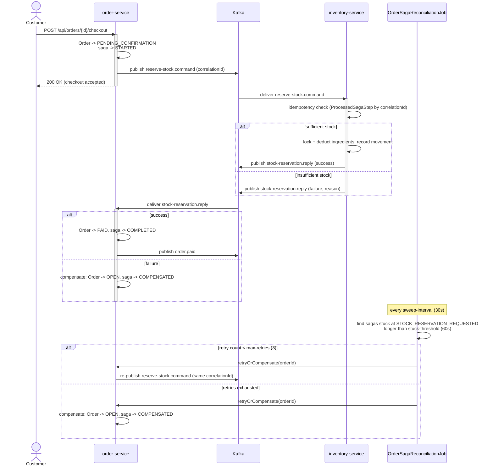

# Cafe Management System

🇬🇧 English is expanded by default below — 🇻🇳 nhấn vào phần "Tiếng Việt" bên dưới để mở nội dung tiếng Việt.

<details open>
<summary><strong>🇬🇧 English</strong></summary>

Cafe management web app — microservices architecture (Spring Boot + Angular + PostgreSQL + Kafka), built primarily as a learning project for canonical microservice patterns rather than to optimize for the shortest path to a working app.

See the implementation plan for the full design (domain model, service boundaries, checkout saga, routing, docker-compose).

## Services

| Service | Port | Responsibility |
|---|---|---|
| eureka-server | 8761 | Service discovery registry |
| config-server | 8888 | Centralized configuration (Spring Cloud Config, native profile) |
| gateway | 8080 | Single entry point for the frontend — routing, CORS, JWT verification |
| auth-service | 8081 | User accounts, login, JWT issuance |
| menu-service | 8082 | Categories & menu items |
| order-service | 8083 | Dining tables, orders, checkout saga orchestration |
| inventory-service | 8084 | Ingredients, stock levels, recipes, stock reservation (saga participant) |
| report-service | 8085 | Scaffolded module, not yet implemented |
| postgres | 5432 | One database (and one DB role) per service |
| kafka | 9092 / 9094 | Event backbone for the order↔inventory checkout saga |
| kafka-ui | 8090 | Web UI for inspecting Kafka topics |

Each of auth/menu/order/inventory-service exposes Swagger UI at `http://localhost:<port>/swagger-ui.html` for interactive API docs.

## Service communication



Edge color marks the kind of communication: 🟦 blue for gateway HTTP routing, 🟧 orange for the direct synchronous service-to-service call, 🟪 purple for Kafka messaging, and ⬜ grey for service discovery/config lookups. Solid arrows carry actual request/business traffic; dashed arrows are infrastructure plumbing or paths that exist but have no consumer/handler yet. Note that `order-service → menu-service` is a direct service-to-service call resolved via Eureka — it bypasses the gateway, since the gateway is only the entry point for frontend traffic. Kafka topics (`reserve-stock.command`, `stock-reservation.reply`, `order.paid`) are drawn as a single edge between publisher and consumer labeled with the topic name, rather than as separate producer→Kafka and Kafka→consumer hops — Kafka is still the broker underneath, this just keeps the diagram from having to route every topic through the `Kafka` node explicitly.

## Business flow: checkout saga

The topology diagram above shows *who talks to whom*; this shows the *order* checkout happens in, including the failure path. `order-service` runs this as an orchestrated state machine (not choreography) since inventory reservation is the only step that can fail and needs compensation.



Two failure paths are handled differently:

- **A reply arrives, but says "no stock"** — handled directly in `onStockReservationReply`: the order is compensated back to `OPEN` immediately.
- **No reply ever arrives** (inventory-service was down, the message was lost) — nothing in the request/reply exchange can detect this, since there's no message to receive. This is what `OrderSagaReconciliationJob` exists for (the **Reconciliation** pattern): it sweeps for sagas stuck at `STOCK_RESERVATION_REQUESTED` past `stuck-threshold` and either retries or gives up and compensates.

Retrying is safe to repeat because it re-publishes with the *same* `correlationId`: Kafka keys the message by `orderId`, so every attempt lands in the same partition and is processed in order by inventory-service, whose `ProcessedSagaStep` table is keyed on `correlationId` — a redelivery just replays the stored outcome instead of deducting stock twice.

## Auth flow

1. Client logs in via `POST /api/auth/login` (public, no token required) — auth-service checks credentials and issues an RS256-signed JWT.
2. Every other request carries that JWT as `Authorization: Bearer <token>`.
3. The gateway's `JwtAuthGlobalFilter` is the only place that ever sees or verifies the JWT: it strips any `X-User-*` headers the client tried to set itself (so identity can't be spoofed), verifies the signature with auth-service's public key (fetched from config-server), and — only on success — sets trusted `X-User-Id` / `X-Username` / `X-User-Role` headers from the token's claims.
4. Downstream services never see the JWT; they trust the gateway's headers via `common-lib`'s `HeaderAuthenticationFilter`. A missing or invalid token gets a `401` at the gateway, before it ever reaches a domain service.

## Patterns in use

Since this project's purpose is to practice canonical patterns, worth calling out explicitly which ones are implemented so far:

- **Service Discovery** — Eureka (`eureka-server`)
- **API Gateway** — Spring Cloud Gateway, single entry point + CORS + routing
- **Externalized Configuration** — Spring Cloud Config Server, native profile backed by a bind-mounted `config-repo` (see below)
- **Trusted Header Authentication** — gateway validates the JWT once and forwards identity via `X-User-Id`/`X-Username`/`X-User-Role` headers; downstream services trust the gateway instead of re-validating (`common-lib`'s `TrustedHeaderAuth`)
- **Circuit Breaker + Retry** — Resilience4j on order-service's calls to menu-service
- **Orchestrated Saga** — order-service's checkout flow drives a state machine (`OrderCheckoutSaga`) that requests stock reservation from inventory-service over Kafka and commits or compensates the order based on the reply; see [Business flow: checkout saga](#business-flow-checkout-saga)
- **Idempotent Consumer, via Transactional Inbox** — `StockReservationService.reserve()` checks `ProcessedSagaStep` (the inbox table, keyed on `correlationId`) before doing anything, and writes the outcome to it in the *same* transaction as the stock deduction it guards. Because the inbox write and the business change commit atomically together, a redelivered command can never see one applied without the other — it just replays the stored result.
- **Reconciliation** — `OrderSagaReconciliationJob` sweeps sagas stuck waiting on a reply and retries or compensates them
- **Dead Letter Queue** — inventory-service routes `inventory.reserve-stock.command` messages that fail for *technical* reasons (bad payload, bugs, DB errors — never a business "insufficient stock" outcome, which is a normal reply, not an exception) to `inventory.reserve-stock.command.dlq` after a short exponential-backoff retry, instead of blocking the consumer on a poison-pill message
- **Database per Service** — separate Postgres database and role per service

## Structure

```
backend/    Maven multi-module reactor: 5 domain services + gateway + eureka-server + config-server + common-lib
frontend/   Angular (standalone components)
docker/     Postgres init scripts
```

config-server's native config lives at `backend/config-server/src/main/resources/config-repo/`. It's bind-mounted read-only into the `config-server` container (see `docker-compose.yml`), so editing a `config-repo/*.yml` file only requires `docker compose restart config-server` (plus restarting whichever downstream service reads that config) — no image rebuild.

## Prerequisites

- Java 21
- Node.js 20+ (Angular 21 / npm 11)
- Docker & Docker Compose

## Running locally

```bash
docker-compose up -d
cd frontend && ng serve
```

Gateway (the single entry point for the frontend): http://localhost:8080
Eureka dashboard: http://localhost:8761
Kafka UI: http://localhost:8090

There's no self-registration flow — staff accounts are provisioned by an ADMIN. On first boot, auth-service auto-seeds a default admin account (`admin` / `admin123`) if the `users` table is empty, so you have something to log in with. It's dev-only; a real deployment should seed its first admin out-of-band instead. Roles are `ADMIN` and `CASHIER`.

## Troubleshooting

- **Gateway returns 503 right after restarting a service** — Spring Cloud Gateway's load balancer keeps a short-lived cache of service instances resolved via Eureka; it can go stale for a few seconds after a restart. Retry after ~5s before assuming something's actually broken.
- **Docker build cache eating disk space** — repeated `docker compose build` during iterative development leaves old image layers behind indefinitely. Run `docker builder prune -f` periodically to reclaim space, or `docker system df` to check what's actually using it.
- **A service can't reach another (Eureka lookups hang or 500) when you run one bare from an IDE alongside the rest in Docker** — every service's `eureka.instance.hostname` defaults to `host.docker.internal` rather than its auto-detected host IP, because on Windows that auto-detected IP can land on a virtual adapter (VPN/WSL/Hyper-V) that Docker containers can't route to. `host.docker.internal` works both directions — Docker Desktop hairpins a container's own published port back through it, so containers and bare-host processes can reach each other through it uniformly. Fully-dockerized services can instead register by container IP (`docker-compose.yml` sets `EUREKA_INSTANCE_PREFER_IP_ADDRESS=true` for order-service), which is simpler when nothing runs bare.

</details>

<details>
<summary><strong>🇻🇳 Tiếng Việt</strong></summary>

Ứng dụng quản lý quán cà phê — kiến trúc microservices (Spring Boot + Angular + PostgreSQL + Kafka), được xây dựng chủ yếu như một dự án học tập các pattern microservice kinh điển, thay vì để tối ưu cho việc có ứng dụng chạy được nhanh nhất.

Xem file kế hoạch triển khai để biết đầy đủ thiết kế (domain model, ranh giới giữa các service, checkout saga, routing, docker-compose).

## Các service

| Service | Port | Trách nhiệm |
|---|---|---|
| eureka-server | 8761 | Registry cho service discovery |
| config-server | 8888 | Cấu hình tập trung (Spring Cloud Config, profile native) |
| gateway | 8080 | Cổng vào duy nhất cho frontend — routing, CORS, xác thực JWT |
| auth-service | 8081 | Tài khoản người dùng, đăng nhập, cấp JWT |
| menu-service | 8082 | Danh mục & món trong menu |
| order-service | 8083 | Bàn ăn, đơn hàng, điều phối checkout saga |
| inventory-service | 8084 | Nguyên liệu, tồn kho, công thức, giữ chỗ tồn kho (thành viên saga) |
| report-service | 8085 | Module mới scaffold, chưa triển khai |
| postgres | 5432 | Mỗi service có 1 database (và 1 role DB) riêng |
| kafka | 9092 / 9094 | Event backbone cho checkout saga giữa order↔inventory |
| kafka-ui | 8090 | Giao diện web để xem các Kafka topic |

Mỗi service trong số auth/menu/order/inventory-service đều expose Swagger UI tại `http://localhost:<port>/swagger-ui.html` để xem tài liệu API tương tác.

## Giao tiếp giữa các service


Màu của đường nối thể hiện loại giao tiếp: 🟦 xanh dương là routing HTTP qua gateway, 🟧 cam là lời gọi đồng bộ trực tiếp giữa 2 service, 🟪 tím là giao tiếp qua Kafka, và ⬜ xám là tra cứu service discovery/config. Đường liền là traffic nghiệp vụ thật; đường đứt là hạ tầng nền (infra plumbing) hoặc đường đi tồn tại nhưng chưa có consumer/handler xử lý. Lưu ý `order-service → menu-service` là lời gọi trực tiếp giữa 2 service, được phân giải qua Eureka — không đi qua gateway, vì gateway chỉ là cổng vào cho traffic từ frontend. Các topic Kafka (`reserve-stock.command`, `stock-reservation.reply`, `order.paid`) được vẽ thành 1 đường nối duy nhất giữa publisher và consumer, ghi tên topic ngay trên đó, thay vì tách thành 2 chặng producer→Kafka và Kafka→consumer riêng biệt — Kafka vẫn là broker đứng bên dưới, cách vẽ này chỉ để khỏi phải dẫn mọi topic qua node `Kafka` một cách tường minh.

## Luồng nghiệp vụ: saga thanh toán

Biểu đồ topology ở trên cho biết *ai nói chuyện với ai*; còn biểu đồ này cho biết *thứ tự* các bước diễn ra khi checkout, kể cả đường đi khi thất bại. `order-service` chạy luồng này dưới dạng một state machine điều phối tập trung (orchestration, không phải choreography), vì việc giữ chỗ tồn kho là bước duy nhất có thể thất bại và cần compensate.


Hai đường lỗi được xử lý khác nhau:

- **Có reply trả về, nhưng báo "hết hàng"** — được xử lý trực tiếp trong `onStockReservationReply`: đơn hàng được compensate về trạng thái `OPEN` ngay lập tức.
- **Không có reply nào trả về** (inventory-service bị down, message bị mất) — bản thân cơ chế request/reply không thể phát hiện được trường hợp này, vì đơn giản là không có message nào để nhận. Đây chính là lý do tồn tại của `OrderSagaReconciliationJob` (pattern **Reconciliation**): job này quét các saga bị kẹt ở trạng thái `STOCK_RESERVATION_REQUESTED` quá `stuck-threshold`, rồi retry hoặc bỏ cuộc và compensate.

Việc retry lặp lại nhiều lần vẫn an toàn, vì mỗi lần đều publish lại với *cùng* `correlationId`: Kafka key message theo `orderId`, nên mọi lần gửi đều rơi vào cùng 1 partition và được inventory-service xử lý tuần tự; bảng `ProcessedSagaStep` của inventory-service dùng `correlationId` làm khóa chính — nên khi message bị gửi lại, nó chỉ trả về đúng kết quả đã lưu từ trước, thay vì trừ kho thêm lần nữa.

## Luồng xác thực

1. Client đăng nhập qua `POST /api/auth/login` (public, không cần token) — auth-service kiểm tra thông tin đăng nhập và cấp JWT ký bằng RS256.
2. Mọi request sau đó đều mang JWT này qua header `Authorization: Bearer <token>`.
3. `JwtAuthGlobalFilter` ở gateway là nơi duy nhất từng thấy và xác thực JWT: nó xóa bỏ mọi header `X-User-*` mà client tự gửi lên (để không thể giả mạo danh tính), xác thực chữ ký bằng public key của auth-service (lấy từ config-server), và chỉ khi thành công mới set các header đáng tin cậy `X-User-Id`/`X-Username`/`X-User-Role` dựa trên claim trong token.
4. Các service phía sau không bao giờ thấy JWT; chúng tin tưởng header do gateway set, thông qua `HeaderAuthenticationFilter` trong `common-lib`. Token thiếu hoặc không hợp lệ sẽ bị trả về `401` ngay tại gateway, trước khi tới được bất kỳ service nghiệp vụ nào.

## Các pattern đã áp dụng

Vì mục đích của dự án là luyện tập các pattern kinh điển, nên liệt kê rõ những pattern nào đã được áp dụng tính tới thời điểm hiện tại:

- **Service Discovery** — Eureka (`eureka-server`)
- **API Gateway** — Spring Cloud Gateway, cổng vào duy nhất + CORS + routing
- **Externalized Configuration** — Spring Cloud Config Server, profile native được backing bởi `config-repo` bind-mount (xem phần bên dưới)
- **Trusted Header Authentication** — gateway xác thực JWT một lần duy nhất rồi chuyển tiếp danh tính qua header `X-User-Id`/`X-Username`/`X-User-Role`; các service phía sau tin tưởng gateway thay vì tự xác thực lại (`TrustedHeaderAuth` trong `common-lib`)
- **Circuit Breaker + Retry** — Resilience4j cho lời gọi từ order-service sang menu-service
- **Orchestrated Saga** — luồng checkout của order-service điều khiển một state machine (`OrderCheckoutSaga`), yêu cầu giữ chỗ tồn kho từ inventory-service qua Kafka, rồi commit hoặc compensate đơn hàng dựa theo reply nhận được; xem mục "Luồng nghiệp vụ: saga thanh toán" bên trên
- **Idempotent Consumer, qua Transactional Inbox** — `StockReservationService.reserve()` kiểm tra `ProcessedSagaStep` (bảng "inbox", khoá chính là `correlationId`) trước khi làm bất cứ gì, và ghi kết quả vào đó **trong cùng 1 transaction** với việc trừ kho mà nó bảo vệ. Vì việc ghi inbox và thay đổi nghiệp vụ commit cùng lúc, 1 message bị gửi lại không bao giờ rơi vào tình huống "chỉ có 1 trong 2 việc được thực hiện" — nó chỉ đơn giản trả lại kết quả đã lưu từ trước.
- **Reconciliation** — `OrderSagaReconciliationJob` quét các saga bị kẹt khi chờ reply, rồi retry hoặc compensate
- **Dead Letter Queue** — inventory-service chuyển các message `inventory.reserve-stock.command` lỗi vì nguyên nhân *kỹ thuật* (payload sai định dạng, bug, lỗi DB — không bao giờ tính trường hợp nghiệp vụ "hết hàng", vì đó là 1 reply bình thường, không phải exception) sang `inventory.reserve-stock.command.dlq` sau vài lần retry theo exponential backoff, thay vì để nó chặn cứng consumer (poison-pill message)
- **Database per Service** — mỗi service có 1 database Postgres và 1 role riêng

## Cấu trúc

```
backend/    Maven multi-module reactor: 5 domain service + gateway + eureka-server + config-server + common-lib
frontend/   Angular (standalone components)
docker/     Script khởi tạo Postgres
```

Cấu hình native của config-server nằm ở `backend/config-server/src/main/resources/config-repo/`. Thư mục này được bind-mount dạng read-only vào container `config-server` (xem `docker-compose.yml`), nên sửa 1 file `config-repo/*.yml` chỉ cần `docker compose restart config-server` (và restart luôn service nào đang đọc config đó) — không cần rebuild lại image.

## Yêu cầu môi trường

- Java 21
- Node.js 20+ (Angular 21 / npm 11)
- Docker & Docker Compose

## Chạy ở local

```bash
docker-compose up -d
cd frontend && ng serve
```

Gateway (cổng vào duy nhất cho frontend): http://localhost:8080
Eureka dashboard: http://localhost:8761
Kafka UI: http://localhost:8090

Không có flow tự đăng ký — tài khoản nhân viên chỉ được tạo bởi ADMIN. Ở lần khởi động đầu tiên, auth-service tự động seed 1 tài khoản admin mặc định (`admin` / `admin123`) nếu bảng `users` đang rỗng, để có tài khoản đăng nhập ban đầu. Tài khoản này chỉ dùng cho dev; khi triển khai thật cần seed tài khoản admin đầu tiên theo cách khác (out-of-band). Có 2 role: `ADMIN` và `CASHIER`.

## Xử lý sự cố thường gặp

- **Gateway trả về 503 ngay sau khi restart 1 service** — load balancer của Spring Cloud Gateway giữ cache instance của service (phân giải qua Eureka) trong thời gian ngắn; cache này có thể bị stale vài giây sau khi restart. Thử lại sau ~5s trước khi kết luận là lỗi thật.
- **Docker build cache chiếm hết dung lượng ổ đĩa** — build đi build lại nhiều lần (`docker compose build`) trong lúc dev để lại các layer image cũ, không tự dọn. Chạy `docker builder prune -f` định kỳ để giải phóng dung lượng, hoặc `docker system df` để xem cái gì đang chiếm chỗ.
- **1 service không gọi được service khác (Eureka lookup treo hoặc trả 500) khi chạy 1 service bare từ IDE cùng lúc với phần còn lại đang chạy Docker** — `eureka.instance.hostname` của mỗi service mặc định là `host.docker.internal` thay vì IP tự nhận diện, vì trên Windows, IP tự nhận diện đó có thể rơi vào 1 virtual adapter (VPN/WSL/Hyper-V) mà container Docker không route tới được. `host.docker.internal` hoạt động theo cả 2 chiều — Docker Desktop "hairpin" cổng của chính container đó vòng qua host, nên cả container lẫn tiến trình chạy bare đều gọi được lẫn nhau qua đường này. Nếu mọi thứ đều chạy trong Docker (không có gì bare) thì có thể đăng ký thẳng bằng IP container cho đơn giản hơn (`docker-compose.yml` đã set `EUREKA_INSTANCE_PREFER_IP_ADDRESS=true` cho order-service).

</details>
