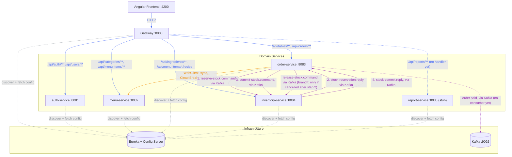

# Cafe Management System

🇬🇧 English is expanded by default below — 🇻🇳 nhấn vào phần "Tiếng Việt" bên dưới để mở nội dung tiếng Việt.

<details open>
<summary><strong>🇬🇧 English</strong></summary>

Cafe management web app — microservices architecture (Spring Boot + Angular + PostgreSQL + Kafka), built primarily as a learning project for canonical microservice patterns rather than to optimize for the shortest path to a working app.

The full design — domain model, service boundaries, checkout saga, routing, docker-compose — is covered by the sections below.

## Services

| Service | Port | Responsibility |
|---|---|---|
| eureka-server | 8761 | Service discovery registry |
| config-server | 8888 | Centralized configuration (Spring Cloud Config, native profile) |
| gateway | 8080 | Single entry point for the frontend — routing, CORS, JWT verification |
| auth-service | 8081 | User accounts, login, JWT issuance |
| menu-service | 8082 | Categories & menu items |
| order-service | 8083 | Dining tables, orders, checkout saga orchestration |
| inventory-service | 8084 | Ingredients, stock levels, recipes, stock reservation (saga participant) |
| report-service | 8085 | Scaffolded module, not yet implemented |
| postgres | 5432 | One database (and one DB role) per service |
| kafka | 9092 / 9094 | Event backbone for the order↔inventory checkout saga |
| kafka-ui | 8090 | Web UI for inspecting Kafka topics |
| zipkin | 9411 | Distributed tracing UI — inspect a request's full trace across every service |

Each of auth/menu/order/inventory-service exposes Swagger UI at `http://localhost:<port>/swagger-ui.html` for interactive API docs.

## Service communication



Edge color marks the kind of communication: 🟦 blue for gateway HTTP routing, 🟧 orange for the direct synchronous service-to-service call, 🟪 purple for Kafka messaging, and ⬜ grey for service discovery/config lookups. Solid arrows carry actual request/business traffic; dashed arrows are infrastructure plumbing or paths that exist but have no consumer/handler yet. Note that `order-service → menu-service` is a direct service-to-service call resolved via Eureka — it bypasses the gateway, since the gateway is only the entry point for frontend traffic. Kafka topics (`reserve-stock.command`, `stock-reservation.reply`, `commit-stock.command`, `stock-commit.reply`, `release-stock.command`, `order.paid`) are drawn as a single edge between publisher and consumer labeled with the topic name, rather than as separate producer→Kafka and Kafka→consumer hops — Kafka is still the broker underneath, this just keeps the diagram from having to route every topic through the `Kafka` node explicitly. The `1.`–`4.` prefixes on the order-service ↔ inventory-service edges are the order they fire in during a normal checkout-then-payment (this diagram is a static topology, not a timeline, so a plain edge can't otherwise convey that); `release-stock.command` is unnumbered since it's a separate branch, only published if a `CONFIRMED` order gets cancelled. For the full step-by-step, including every failure path, see [Business flow: checkout and payment saga](#business-flow-checkout-and-payment-saga) below.

## Business flow: checkout and payment saga

The topology diagram above shows *who talks to whom*; this shows the *order* the steps happen in, including every failure path. `order-service` runs this as an orchestrated state machine (not choreography) since stock handling is the only part that can fail and needs compensation — and it's now two separate saga legs, not one.

Stock is handled as a **soft reservation**, not a single deduction: verifying an order *holds* quantity (`Ingredient.reservedQuantity`) without touching `currentStock`; only paying actually deducts it. Availability for a new reservation is always `currentStock - reservedQuantity`, so two in-flight orders can never both claim the same physical stock.

```mermaid
sequenceDiagram
    actor Customer
    participant OS as order-service
    participant K as Kafka
    participant IS as inventory-service (listener)
    participant OP as OutboxPoller (order-service)
    participant Poller as InboxPoller
    participant Job as OrderSagaReconciliationJob

    Note over OS,IS: Verify leg - soft-reserve stock
    Customer->>OS: POST /api/orders/{id}/checkout
    activate OS
    OS->>OS: Order -> PENDING_CONFIRMATION<br/>saga -> STARTED -> STOCK_RESERVATION_REQUESTED<br/>enqueue OutboxMessage (PENDING) - one transaction
    OS-->>Customer: 202 Accepted
    deactivate OS

    loop OutboxPoller sweep (poll-interval)
        OP->>OP: claim next PENDING batch<br/>(SELECT ... FOR UPDATE SKIP LOCKED -> PROCESSING)
        activate OP
        OP->>K: publish reserve-stock.command (correlationId)
        OP->>OP: mark OutboxMessage PUBLISHED (broker ack received)
        deactivate OP
    end

    K->>IS: deliver reserve-stock.command
    activate IS
    IS->>IS: enqueue InboxMessage (PENDING, correlationId)
    IS-->>K: ack
    deactivate IS

    loop InboxPoller sweep (poll-interval)
        Poller->>Poller: claim next PENDING batch<br/>(SELECT ... FOR UPDATE SKIP LOCKED -> PROCESSING)
        activate Poller
        alt sufficient stock (currentStock - reservedQuantity)
            Poller->>Poller: reservedQuantity += required (currentStock untouched)
            Poller->>K: publish stock-reservation.reply (success)
        else insufficient stock
            Poller->>K: publish stock-reservation.reply (failure, reason)
        end
        Poller->>Poller: mark InboxMessage PROCESSED (result stored)
        deactivate Poller
    end

    K->>OS: deliver stock-reservation.reply
    activate OS
    alt success
        OS->>OS: Order -> CONFIRMED<br/>saga -> CONFIRMED
    else failure
        OS->>OS: compensate: Order -> OPEN<br/>saga -> COMPENSATED
    end
    deactivate OS

    Note over OS,IS: Payment leg - commit the hold
    Customer->>OS: POST /api/orders/{id}/pay
    activate OS
    OS->>OS: Order -> PAYMENT_PENDING<br/>saga -> PAYMENT_REQUESTED (fresh correlationId)<br/>enqueue OutboxMessage (PENDING) - one transaction
    OS-->>Customer: 202 Accepted
    deactivate OS

    loop OutboxPoller sweep (poll-interval)
        OP->>OP: claim next PENDING batch<br/>(SELECT ... FOR UPDATE SKIP LOCKED -> PROCESSING)
        activate OP
        OP->>K: publish commit-stock.command (correlationId)
        OP->>OP: mark OutboxMessage PUBLISHED (broker ack received)
        deactivate OP
    end

    K->>IS: deliver commit-stock.command
    activate IS
    IS->>IS: enqueue InboxMessage (PENDING, correlationId)
    IS-->>K: ack
    deactivate IS

    loop InboxPoller sweep (poll-interval)
        Poller->>Poller: claim next PENDING batch<br/>(SELECT ... FOR UPDATE SKIP LOCKED -> PROCESSING)
        activate Poller
        Poller->>Poller: currentStock -= required<br/>reservedQuantity -= required<br/>record StockMovement
        Poller->>K: publish stock-commit.reply (success)
        Poller->>Poller: mark InboxMessage PROCESSED (result stored)
        deactivate Poller
    end

    K->>OS: deliver stock-commit.reply
    activate OS
    alt success
        OS->>OS: Order -> PAID<br/>saga -> COMPLETED<br/>enqueue OutboxMessage (order.paid) - same transaction
        OP->>K: (async, same OutboxPoller loop as above) publish order.paid
    else failure (rare - the hold was already validated at reserve time)
        OS->>OS: revert: Order -> CONFIRMED<br/>saga -> CONFIRMED
    end
    deactivate OS

    Note over OS,Job: Reconciliation - either leg, every sweep-interval (30s)
    Job->>Job: find sagas stuck at STOCK_RESERVATION_REQUESTED<br/>or PAYMENT_REQUESTED past stuck-threshold (60s)
    alt verify leg, retries remain
        Job->>OS: retryOrCompensate(orderId)
        OS->>OS: enqueue OutboxMessage (reserve-stock, same correlationId)
    else verify leg, retries exhausted
        Job->>OS: retryOrCompensate(orderId)
        OS->>OS: compensate: Order -> OPEN
    else payment leg, retries remain
        Job->>OS: retryOrCompensate(orderId)
        OS->>OS: enqueue OutboxMessage (commit-stock, same correlationId)
    else payment leg, retries exhausted
        Job->>OS: retryOrCompensate(orderId)
        OS->>OS: revert: Order -> CONFIRMED (stock hold stays)
    end

    Note over OS,IS: Cancelling a CONFIRMED order - release the hold
    Customer->>OS: POST /api/orders/{id}/cancel
    OS->>OS: Order -> CANCELLED<br/>enqueue OutboxMessage (release-stock) - same transaction
    OP->>K: (async, same OutboxPoller loop as above) publish release-stock.command
    K->>IS: deliver release-stock.command
    IS->>IS: enqueue InboxMessage (PENDING, correlationId)
    IS-->>K: ack
    Poller->>Poller: claim, then reservedQuantity -= required<br/>(currentStock untouched), mark PROCESSED
```



Both legs fail the same two ways:

- **A reply arrives, but says no** — handled directly in the reply listener: `onStockReservationReply` compensates the verify leg back to `OPEN`; `onStockCommitReply` reverts the payment leg back to `CONFIRMED` (the stock hold is still legitimate — only the commit attempt failed, so there's nothing to re-verify, just retry payment).
- **No reply ever arrives** (inventory-service was down, the message was lost) — nothing in the request/reply exchange can detect this on its own. `OrderSagaReconciliationJob` now sweeps both legs (`STOCK_RESERVATION_REQUESTED` and `PAYMENT_REQUESTED`) past `stuck-threshold`, and `retryOrCompensate` branches on which leg it finds: the verify leg gives up to `OPEN` (nothing was ever held), the payment leg gives up to `CONFIRMED` (the hold stays — same reasoning as the reply-arrives-but-fails case).

Retrying either leg is safe to repeat because it re-queues the *same* `correlationId` for that leg into the outbox (a fresh one is minted per leg via `OrderSagaStateService.start`/`startPaymentAttempt`): Kafka keys the message by `orderId`, so every attempt lands in the same partition and is processed in order by inventory-service, whose `inbox_messages` table is keyed on `correlationId` (the Transactional Inbox above) — a redelivery of an already-`PROCESSED` correlationId just gets the stored reply resent instead of the effect being applied twice. Cancelling a `CONFIRMED` order's release is still deliberately **not** covered by reconciliation — it's fire-and-forget with no reply to watch. Transactional Outbox below closes the narrower gap of "the release command was never sent because the process crashed before the live Kafka call" (it's now durably queued in the same transaction as the cancellation), but it doesn't add a reply/compensation leg to release — if inventory-service is down long enough that its own retry budget (`app.outbox.max-attempts`) is exhausted, that release is marked `FAILED` and nothing retries it further.

### Order status × saga step

The two state machines above move together but aren't the same thing: `Order.status` is what the POS UI polls and displays; `OrderSagaState.step` is orchestration bookkeeping the API never exposes directly. This table is every reachable combination and what triggers each transition:

| Consumed message (causes this row) | Order status | Saga step | Published message (queued once marked) | Trigger |
|---|---|---|---|---|
| — | `OPEN` | *(no saga row yet)* | — | Order created |
| — | `PENDING_CONFIRMATION` | `STARTED` → `STOCK_RESERVATION_REQUESTED` | `reserve-stock.command` | `POST /checkout` → `OrderCheckoutSaga.startCheckout`: one transaction moves the order to `PENDING_CONFIRMATION`, creates the saga row (fresh `correlationId`), and queues the `RESERVE_STOCK` outbox message |
| `stock-reservation.reply` (success) | `CONFIRMED` | `CONFIRMED` | — | inventory-service replies success → `onStockReservationReply` → `markConfirmed` (order + saga together) |
| `stock-reservation.reply` (failure) — or none, on reconciliation timeout | `OPEN` (`failureReason` set) | `COMPENSATED` | — | inventory-service replies failure, **or** `OrderSagaReconciliationJob` exhausts `max-retries` with no reply → `compensateToOpen` + `markCompensated` |
| — | `PAYMENT_PENDING` | `PAYMENT_REQUESTED` | `commit-stock.command` | `POST /pay` → `startPayment`: order → `PAYMENT_PENDING`, same saga row gets a fresh `correlationId` + reset retry count, `COMMIT_STOCK` outbox message queued — same one-transaction shape as checkout |
| `stock-commit.reply` (success) | `PAID` (`closedAt` set) | `COMPLETED` | `order.paid` | inventory-service replies success → `onStockCommitReply` → `markPaid` + `markCompleted`, and an `ORDER_PAID` outbox message is queued in the same transaction |
| `stock-commit.reply` (failure) — or none, on reconciliation timeout | `CONFIRMED` (`failureReason` set) | `CONFIRMED` | — | inventory-service replies failure, **or** reconciliation exhausts retries → `revertToConfirmed` + `markConfirmed` — stock hold stays intact, only the payment attempt is retried |
| — | `CANCELLED` | *(saga row untouched)* | `release-stock.command` (fire-and-forget) | `POST /cancel` → `OrderCheckoutSaga.cancelOrder`, only from `OPEN` or `CONFIRMED` (blocked while a leg is in flight, blocked once `PAID`); cancelling from `CONFIRMED` also queues a `RELEASE_STOCK` outbox message in the same transaction, with no saga step of its own |

"Consumed message" is the Kafka reply the saga was waiting for that causes the row's transition — blank where the trigger is an HTTP call instead (`POST /checkout`, `/pay`, `/cancel`) or a reconciliation timeout with no message at all. "Published message" is what gets queued to the outbox once the order/saga-state change in that row commits — it's a queue, not a live send: `OutboxPoller` relays it to Kafka asynchronously afterward (see Transactional Outbox below), so there's a short async gap between a row in this table becoming true and the published message actually reaching Kafka.

Two things worth knowing that aren't obvious from the table alone: `shouldIgnoreReply` (see Idempotent Consumer below) treats `COMPLETED`, `COMPENSATED`, **and** the `CONFIRMED` step as terminal/idle for reply-matching purposes — a reply arriving in any of those is necessarily a stale redelivery, since the only thing that could produce a fresh one while at `CONFIRMED` (a commit-stock reply) is never sent until `startPayment` has already moved the step past it. And `SagaStep` also declares a `COMPENSATING` value that no code path currently assigns — it's not part of the live flow, just reserved for a future in-flight compensation state if one is ever needed.

## Auth flow

1. Client logs in via `POST /api/auth/login` (public, no token required) — auth-service checks credentials and issues an RS256-signed JWT.
2. Every other request carries that JWT as `Authorization: Bearer <token>`.
3. The gateway's `JwtAuthGlobalFilter` is the only place that ever sees or verifies the JWT: it strips any `X-User-*` headers the client tried to set itself (so identity can't be spoofed), verifies the signature with auth-service's public key (fetched from config-server), and — only on success — sets trusted `X-User-Id` / `X-Username` / `X-User-Role` headers from the token's claims.
4. Downstream services never see the JWT; they trust the gateway's headers via `common-lib`'s `HeaderAuthenticationFilter`. A missing or invalid token gets a `401` at the gateway, before it ever reaches a domain service.

## Patterns in use

Since this project's purpose is to practice canonical patterns, worth calling out explicitly which ones are implemented so far, grouped by what problem they solve rather than by when they were added. Names follow the common catalog (Chris Richardson's [microservices.io](https://microservices.io/patterns/index.html) covers all of these except Circuit Breaker/Retry, which is Enterprise Integration Patterns territory) — worth looking up the canonical definition first if a name is unfamiliar, then coming back to see how this codebase applies it.

### Platform

- **Service Discovery** — Eureka (`eureka-server`)
- **API Gateway** — Spring Cloud Gateway, single entry point + CORS + routing
- **Externalized Configuration** — Spring Cloud Config Server, native profile backed by a bind-mounted `config-repo` (see below)
- **Trusted Header Authentication** — gateway validates the JWT once and forwards identity via `X-User-Id`/`X-Username`/`X-User-Role` headers; downstream services trust the gateway instead of re-validating (`common-lib`'s `TrustedHeaderAuth`)
- **Database per Service** — separate Postgres database and role per service

### Resilience

- **Circuit Breaker + Retry** — Resilience4j on order-service's calls to menu-service

### Checkout saga & consistency

- **Orchestrated Saga** — order-service's checkout flow drives a state machine (`OrderCheckoutSaga`) with two legs: verify (soft-reserve stock, `OPEN`→`CONFIRMED`) and pay (commit the hold, `CONFIRMED`→`PAID`), each its own Kafka round trip that commits or compensates based on the reply; see [Business flow: checkout and payment saga](#business-flow-checkout-and-payment-saga)
- **Try-Confirm/Cancel-style stock reservation** — inventory-service never deducts `currentStock` directly from a checkout attempt. Verifying *tries* a hold (`reservedQuantity`), paying *confirms* it into a real deduction, cancelling a `CONFIRMED` order *cancels* the hold — the same three-step shape as the classic TCC pattern, layered on top of the saga above rather than replacing it

### Messaging reliability

These five all defend the same Kafka exchange (the saga above) against the same two hazards — at-least-once redelivery and "the other side never replies" — each in a different, complementary way:

- **Idempotent Consumer** — makes reprocessing a redelivered message safe, without changing what it does.
  - order-service's checkout saga reply handlers (`OrderCheckoutSaga.onStockReservationReply`/`onStockCommitReply`) use `OrderSagaStateService.shouldIgnoreReply` for this: it treats `COMPLETED`, `COMPENSATED`, and `CONFIRMED` as terminal for the saga's current attempt, plus a stale-correlationId check for a reply belonging to an attempt already superseded by a fresh one.
  - Why `CONFIRMED` counts as terminal too: it's structurally always an idle "waiting for the next user action" state in this state machine (reachable only from a successful verify leg or a failed/reverted payment leg) — no legitimate reply is ever expected while a saga sits there, so anything arriving in that state must be a redelivery of one already consumed.
  - Stays synchronous, unlike Transactional Inbox below — reply processing here is fast and has no side effect beyond updating the saga's own state.
- **Transactional Inbox** — the fuller, asynchronous sibling to Idempotent Consumer: decouples *receiving* a message from *processing* it, instead of doing both inline on the listener thread.
  - `StockReservationListener`'s three `@KafkaListener` methods only persist the incoming command into `inbox_messages` (status `PENDING`, keyed on `correlationId`) and ack — no business logic runs inline.
  - A separate scheduled worker, `InboxPoller`, claims a batch of `PENDING` rows (`SELECT ... FOR UPDATE SKIP LOCKED`, safe under concurrent pollers) and hands each to `InboxMessageProcessor`, which runs the actual `reserve`/`commit`/`release` step and marks the row `PROCESSED` atomically in one transaction, then publishes the reply (reserve/commit only — release has none).
  - Why this needs its own async worker rather than just running inline on the listener thread: reserving/committing stock involves row locks across multiple ingredients and multi-step validation, not something safe or fast enough to do synchronously on a Kafka consumer thread — Transactional Outbox below has the equivalent split (durable write, then a separate relay), but its relay side is comparatively light (send a stored payload, no business logic), so the asymmetry here is about how much work happens *after* the durable write, not whether one exists.
  - `correlationId` stays the idempotency key: a redelivered command with an already-`PROCESSED` row gets the stored reply resent without re-running business logic (needed so `OrderSagaReconciliationJob`'s retry-with-same-correlationId still gets answered); one still `PENDING`/`PROCESSING`/`FAILED` is simply dropped.
  - A technical failure rolls that attempt's transaction back; the row goes back to `PENDING` for another pass (up to `app.inbox.max-attempts`) or, once exhausted, `FAILED` permanently — silently, by design (see Reconciliation below for why that's safe to leave silent).
- **Transactional Outbox** — the send-side mirror of Transactional Inbox above: makes "commit a state change" and "durably guarantee the message that must follow it" atomic, by writing both to the same database in the same transaction instead of committing the state change and then separately calling Kafka live.
  - order-service's `OrderCheckoutSaga` writes an `OutboxMessage` row (status `PENDING`) in the *same* transaction as every order/saga-state change that needs a Kafka message to follow it — reserve, commit, release, and the final `order.paid` event. Before this pattern, those were two separate transactions (local commit, then a live `KafkaTemplate.send()`); a crash in between could leave a saga stuck with no command ever sent, invisible to `OrderSagaReconciliationJob` (which only scans steps a *sent* command produces, not the pre-send `STARTED` step). inventory-service's `InboxMessageProcessor` has the same shape for its two reply topics, queuing the reply in the same transaction as the stock mutation + inbox status update it answers.
  - A separate scheduled `OutboxPoller`, one per service, claims a batch of `PENDING` rows the same `SELECT ... FOR UPDATE SKIP LOCKED` way `InboxPoller` does, and hands each to `OutboxMessagePublisher`, which sends it and blocks on Kafka's send future (`app.outbox.publish-timeout`) so the row only flips to `PUBLISHED` once the broker has actually acknowledged it — anything less would just reopen the same dual-write gap this pattern exists to close.
  - Same retry/give-up shape as Transactional Inbox: a failed send goes back to `PENDING` for another sweep (up to `app.outbox.max-attempts`), then `FAILED` permanently. A row stuck `PROCESSING` because the process crashed after the broker ack but before the commit is a known, accepted exposure window, not reclaimed — same trade-off `InboxPoller` already makes on its side.
- **Reconciliation** — `OrderSagaReconciliationJob` sweeps sagas stuck waiting on a reply on *either* saga leg, and retries or compensates them to the right target state per leg (see the business flow above). This is the safety net for "no reply ever arrives" — Idempotent Consumer and Transactional Inbox only handle a reply that *does* eventually show up, whether on time or redelivered.
- **Dead Letter Queue** — inventory-service routes messages that fail for *technical* reasons at the Kafka-receipt layer (bad payload, bugs, DB errors — never a business "insufficient stock" outcome, which is a normal reply, not an exception) to a `.dlq` topic after a short exponential-backoff retry, instead of blocking the consumer on a poison-pill message. Applies uniformly to all three inventory command topics (`reserve-stock`, `commit-stock`, `release-stock`) via one shared error-handler bean, not configured per topic

### Observability

- **Distributed Tracing** — every service exports spans to Zipkin (`http://localhost:9411`) via Micrometer Tracing + Brave; HTTP (gateway routing, WebClient calls) and Kafka produce/consume are auto-instrumented (`spring.kafka.template`/`listener.observation-enabled`), so a request's `traceId` survives every network hop for free.
  - The one hop auto-instrumentation can't bridge on its own: the checkout saga's async relay threads (`OutboxPoller`→`OutboxMessagePublisher`, `InboxPoller`→`InboxMessageProcessor`) run detached from the Kafka consumer thread that received the triggering message, so there's no live span to inherit there. `OutboxMessage`/`InboxMessage` rows carry a `traceparent` column (W3C format): the *enqueuing* code (`OrderCheckoutSaga.enqueue`, `StockReservationListener.enqueue`, `InboxMessageProcessor.publishReply`) captures the currently-active span into that column at write time, and the *relaying* code (`OutboxMessagePublisher.publishOne`, `InboxMessageProcessor.processOne`) restores it into a fresh child span before doing its work — stitching the async gap back into the same trace instead of starting a disconnected one.
  - A row with no stored traceparent (no live span to capture at enqueue time — e.g. `OrderSagaReconciliationJob`'s scheduled sweep re-queuing a stuck saga) falls back to a fresh root span instead of failing; each reconciliation retry is its own complete, freestanding trace rather than a broken link in the original one.

## Structure

```
backend/    Maven multi-module reactor: 5 domain services + gateway + eureka-server + config-server + common-lib
frontend/   Angular (standalone components)
docker/     Postgres init scripts
```

config-server's native config lives at `backend/config-server/src/main/resources/config-repo/`. It's bind-mounted read-only into the `config-server` container (see `docker-compose.yml`), so editing a `config-repo/*.yml` file only requires `docker compose restart config-server` (plus restarting whichever downstream service reads that config) — no image rebuild.

## Prerequisites

- Java 21
- Node.js 20+ (Angular 21 / npm 11)
- Docker & Docker Compose

## Running locally

```bash
docker-compose up -d
cd frontend && ng serve
```

Gateway (the single entry point for the frontend): http://localhost:8080
Eureka dashboard: http://localhost:8761
Kafka UI: http://localhost:8090

There's no self-registration flow — staff accounts are provisioned by an ADMIN. On first boot, auth-service auto-seeds a default admin account (`admin` / `admin123`) if the `users` table is empty, so you have something to log in with. It's dev-only; a real deployment should seed its first admin out-of-band instead. Roles are `ADMIN` and `CASHIER`.

## Testing

Frontend unit tests run on Angular's Vitest-based test builder:

```bash
cd frontend
npm test               # watch mode
npm run test:coverage  # single run, with an HTML coverage report
```

`test:coverage` writes a drill-down report to `frontend/coverage/frontend/index.html` — open it in a browser to see coverage per folder, then per file, then per line (folders/files are clickable, uncovered lines are highlighted red). Project convention: every new or modified component gets unit tests reaching at least 70% coverage before the work is considered done.

Backend unit tests run per-module with Maven (JUnit 5 + Mockito):

```bash
cd backend
mvn -pl inventory-service -am test
```

Modules that opt into the `jacoco-maven-plugin` (declared once in the parent `pom.xml`'s `pluginManagement`; `common-lib`, `auth-service`, `menu-service`, `order-service`, and `inventory-service` activate it so far) write a drill-down HTML coverage report on every `mvn test` run, at `<module>/target/site/jacoco/index.html` — e.g. `backend/inventory-service/target/site/jacoco/index.html`. It's a plain static file, not served by anything: open it as a `file://` URL, e.g. `file:///<path-to-repo>/backend/inventory-service/target/site/jacoco/index.html` (substitute your own absolute repo path), or just double-click the file. You'll see coverage per package, then per class, then per line (same drill-down shape as the frontend's report; uncovered lines are highlighted red). To check a different module once it opts in, swap the `-pl` module name and the path accordingly. Backend test coverage is being built out module by module rather than all at once; check the codebase for current status instead of treating this README as the tracker.

## Code formatting

Backend uses [Spotless](https://github.com/diffplug/spotless) with Google Java Format, declared once (as an active plugin, not just `pluginManagement`) in the parent `backend/pom.xml` — every module inherits it automatically, no per-module opt-in needed:

```bash
cd backend
mvn spotless:check   # fails if a changed file isn't formatted correctly
mvn spotless:apply   # rewrites files in place to fix it
```

Frontend uses [Prettier](https://prettier.io/), configured via `frontend/.prettierrc`:

```bash
cd frontend
npm run format:check
npm run format
```

Both checks run automatically in a `pre-commit` git hook (`.git/hooks/pre-commit` — not tracked by git, since hooks live outside version control; copy it manually into a fresh clone) that blocks a commit if staged code fails formatting. Spotless's `ratchetFrom` setting means only files that differ from `origin/master` are checked, so the pre-existing codebase keeps whatever formatting it already had until a file is touched again — there's no one-time "reformat everything" commit to wade through.

## Troubleshooting

- **Gateway returns 503 right after restarting a service** — Spring Cloud Gateway's load balancer keeps a short-lived cache of service instances resolved via Eureka; it can go stale for a few seconds after a restart. Retry after ~5s before assuming something's actually broken.
- **Docker build cache eating disk space** — repeated `docker compose build` during iterative development leaves old image layers behind indefinitely. Run `docker builder prune -f` periodically to reclaim space, or `docker system df` to check what's actually using it.
- **A service can't reach another (Eureka lookups hang or 500) when you run one bare from an IDE alongside the rest in Docker** — every service's `eureka.instance.hostname` defaults to `host.docker.internal` rather than its auto-detected host IP, because on Windows that auto-detected IP can land on a virtual adapter (VPN/WSL/Hyper-V) that Docker containers can't route to. `host.docker.internal` is meant to work both directions — Docker Desktop hairpins a container's own published port back through it, so containers and bare-host processes should be able to reach each other through it uniformly. Fully-dockerized services can instead register by container IP (`docker-compose.yml` sets `EUREKA_INSTANCE_PREFER_IP_ADDRESS=true` for order-service), which is simpler when nothing runs bare.

  If this was working and suddenly isn't — calls from a bare-host process (e.g. order-service run from Eclipse) to `host.docker.internal` start timing out, with nothing else changed — the usual cause is that Docker Desktop periodically rewrites its own entry for `host.docker.internal` in the Windows hosts file (`C:\Windows\System32\drivers\etc\hosts`) to the machine's *current* LAN IP (it changes whenever you switch networks or restart Docker Desktop), and that LAN IP is often unreachable for reasons that have nothing to do with the Windows Firewall. Only the **container** side needs Docker's own `host.docker.internal` resolution (which it manages independently of the Windows hosts file); a **bare-host** process reads the real Windows hosts file, so that entry needs to point at `127.0.0.1` instead — a container's published port is always reachable there regardless of which network the machine is currently on. Fix, as Administrator:
  ```powershell
  (Get-Content C:\Windows\System32\drivers\etc\hosts) -replace '^\S+(\s+host\.docker\.internal)$', '127.0.0.1$1' | Set-Content C:\Windows\System32\drivers\etc\hosts -Encoding ASCII
  ```
  Expect to need this again after a Docker Desktop restart or a network change — check `Get-Content C:\Windows\System32\drivers\etc\hosts | Select-String host.docker.internal` first if the bare-host connectivity issue resurfaces.

</details>

<details>
<summary><strong>🇻🇳 Tiếng Việt</strong></summary>

Ứng dụng quản lý quán cà phê — kiến trúc microservices (Spring Boot + Angular + PostgreSQL + Kafka), được xây dựng chủ yếu như một dự án học tập các pattern microservice kinh điển, thay vì để tối ưu cho việc có ứng dụng chạy được nhanh nhất.

Toàn bộ thiết kế — domain model, ranh giới giữa các service, checkout saga, routing, docker-compose — được trình bày trong các mục bên dưới.

## Các service

| Service | Port | Trách nhiệm |
|---|---|---|
| eureka-server | 8761 | Registry cho service discovery |
| config-server | 8888 | Cấu hình tập trung (Spring Cloud Config, profile native) |
| gateway | 8080 | Cổng vào duy nhất cho frontend — routing, CORS, xác thực JWT |
| auth-service | 8081 | Tài khoản người dùng, đăng nhập, cấp JWT |
| menu-service | 8082 | Danh mục & món trong menu |
| order-service | 8083 | Bàn ăn, đơn hàng, điều phối checkout saga |
| inventory-service | 8084 | Nguyên liệu, tồn kho, công thức, giữ chỗ tồn kho (thành viên saga) |
| report-service | 8085 | Module mới scaffold, chưa triển khai |
| postgres | 5432 | Mỗi service có 1 database (và 1 role DB) riêng |
| kafka | 9092 / 9094 | Event backbone cho checkout saga giữa order↔inventory |
| kafka-ui | 8090 | Giao diện web để xem các Kafka topic |
| zipkin | 9411 | Giao diện truy vết phân tán — xem toàn bộ trace của 1 request xuyên suốt các service |

Mỗi service trong số auth/menu/order/inventory-service đều expose Swagger UI tại `http://localhost:<port>/swagger-ui.html` để xem tài liệu API tương tác.

## Giao tiếp giữa các service


Màu của đường nối thể hiện loại giao tiếp: 🟦 xanh dương là routing HTTP qua gateway, 🟧 cam là lời gọi đồng bộ trực tiếp giữa 2 service, 🟪 tím là giao tiếp qua Kafka, và ⬜ xám là tra cứu service discovery/config. Đường liền là traffic nghiệp vụ thật; đường đứt là hạ tầng nền (infra plumbing) hoặc đường đi tồn tại nhưng chưa có consumer/handler xử lý. Lưu ý `order-service → menu-service` là lời gọi trực tiếp giữa 2 service, được phân giải qua Eureka — không đi qua gateway, vì gateway chỉ là cổng vào cho traffic từ frontend. Các topic Kafka (`reserve-stock.command`, `stock-reservation.reply`, `commit-stock.command`, `stock-commit.reply`, `release-stock.command`, `order.paid`) được vẽ thành 1 đường nối duy nhất giữa publisher và consumer, ghi tên topic ngay trên đó, thay vì tách thành 2 chặng producer→Kafka và Kafka→consumer riêng biệt — Kafka vẫn là broker đứng bên dưới, cách vẽ này chỉ để khỏi phải dẫn mọi topic qua node `Kafka` một cách tường minh. Số thứ tự `1.`–`4.` trên các cạnh giữa order-service ↔ inventory-service thể hiện đúng trình tự chúng xảy ra trong 1 lượt checkout-rồi-thanh-toán bình thường (sơ đồ này là topology tĩnh, không phải timeline, nên 1 cạnh trơn không tự nói lên được điều đó); `release-stock.command` không đánh số vì nó là 1 nhánh riêng, chỉ publish khi đơn đang `CONFIRMED` bị hủy. Muốn xem đầy đủ từng bước, kể cả mọi nhánh lỗi, xem mục "Luồng nghiệp vụ: saga xác thực và thanh toán" bên dưới.

## Luồng nghiệp vụ: saga xác thực và thanh toán

Biểu đồ topology ở trên cho biết *ai nói chuyện với ai*; còn biểu đồ này cho biết *thứ tự* các bước diễn ra, kể cả mọi đường đi khi thất bại. `order-service` chạy luồng này dưới dạng một state machine điều phối tập trung (orchestration, không phải choreography), vì phần xử lý tồn kho là phần duy nhất có thể thất bại và cần compensate — và giờ nó là **2 chặng saga riêng biệt**, không còn gộp làm 1.

Tồn kho được xử lý theo mô hình **giữ chỗ mềm (soft reservation)**, không trừ thẳng 1 lần: bước xác thực chỉ *giữ chỗ* số lượng (`Ingredient.reservedQuantity`), không đụng tới `currentStock`; chỉ khi thanh toán mới thực sự trừ. Số lượng khả dụng để giữ chỗ mới luôn là `currentStock - reservedQuantity`, nên 2 đơn đang xử lý cùng lúc không bao giờ giữ trùng cùng 1 phần tồn kho vật lý.

```mermaid
sequenceDiagram
    actor Customer
    participant OS as order-service
    participant K as Kafka
    participant IS as inventory-service (listener)
    participant OP as OutboxPoller (order-service)
    participant Poller as InboxPoller
    participant Job as OrderSagaReconciliationJob

    Note over OS,IS: Chặng Xác thực - giữ chỗ tồn kho (mềm)
    Customer->>OS: POST /api/orders/{id}/checkout
    activate OS
    OS->>OS: Order -> PENDING_CONFIRMATION<br/>saga -> STARTED -> STOCK_RESERVATION_REQUESTED<br/>enqueue OutboxMessage (PENDING) - trong cùng 1 transaction
    OS-->>Customer: 202 Accepted
    deactivate OS

    loop OutboxPoller quét theo poll-interval
        OP->>OP: nhặt batch PENDING kế tiếp<br/>(SELECT ... FOR UPDATE SKIP LOCKED -> PROCESSING)
        activate OP
        OP->>K: publish reserve-stock.command (correlationId)
        OP->>OP: đánh dấu OutboxMessage PUBLISHED (đã nhận ack từ broker)
        deactivate OP
    end

    K->>IS: deliver reserve-stock.command
    activate IS
    IS->>IS: enqueue InboxMessage (PENDING, correlationId)
    IS-->>K: ack
    deactivate IS

    loop InboxPoller quét theo poll-interval
        Poller->>Poller: nhặt batch PENDING kế tiếp<br/>(SELECT ... FOR UPDATE SKIP LOCKED -> PROCESSING)
        activate Poller
        alt đủ hàng (currentStock - reservedQuantity)
            Poller->>Poller: reservedQuantity += required (currentStock không đổi)
            Poller->>K: publish stock-reservation.reply (success)
        else thiếu hàng
            Poller->>K: publish stock-reservation.reply (failure, reason)
        end
        Poller->>Poller: đánh dấu InboxMessage PROCESSED (lưu kết quả)
        deactivate Poller
    end

    K->>OS: deliver stock-reservation.reply
    activate OS
    alt success
        OS->>OS: Order -> CONFIRMED<br/>saga -> CONFIRMED
    else failure
        OS->>OS: compensate: Order -> OPEN<br/>saga -> COMPENSATED
    end
    deactivate OS

    Note over OS,IS: Chặng Thanh toán - commit phần đã giữ chỗ
    Customer->>OS: POST /api/orders/{id}/pay
    activate OS
    OS->>OS: Order -> PAYMENT_PENDING<br/>saga -> PAYMENT_REQUESTED (correlationId mới)<br/>enqueue OutboxMessage (PENDING) - trong cùng 1 transaction
    OS-->>Customer: 202 Accepted
    deactivate OS

    loop OutboxPoller quét theo poll-interval
        OP->>OP: nhặt batch PENDING kế tiếp<br/>(SELECT ... FOR UPDATE SKIP LOCKED -> PROCESSING)
        activate OP
        OP->>K: publish commit-stock.command (correlationId)
        OP->>OP: đánh dấu OutboxMessage PUBLISHED (đã nhận ack từ broker)
        deactivate OP
    end

    K->>IS: deliver commit-stock.command
    activate IS
    IS->>IS: enqueue InboxMessage (PENDING, correlationId)
    IS-->>K: ack
    deactivate IS

    loop InboxPoller quét theo poll-interval
        Poller->>Poller: nhặt batch PENDING kế tiếp<br/>(SELECT ... FOR UPDATE SKIP LOCKED -> PROCESSING)
        activate Poller
        Poller->>Poller: currentStock -= required<br/>reservedQuantity -= required<br/>ghi StockMovement
        Poller->>K: publish stock-commit.reply (success)
        Poller->>Poller: đánh dấu InboxMessage PROCESSED (lưu kết quả)
        deactivate Poller
    end

    K->>OS: deliver stock-commit.reply
    activate OS
    alt success
        OS->>OS: Order -> PAID<br/>saga -> COMPLETED<br/>enqueue OutboxMessage (order.paid) - trong cùng transaction
        OP->>K: (bất đồng bộ, dùng chung loop OutboxPoller ở trên) publish order.paid
    else failure (hiếm - đã validate từ lúc giữ chỗ)
        OS->>OS: revert: Order -> CONFIRMED<br/>saga -> CONFIRMED
    end
    deactivate OS

    Note over OS,Job: Reconciliation - cả 2 chặng, mỗi sweep-interval (30s)
    Job->>Job: tìm saga kẹt ở STOCK_RESERVATION_REQUESTED<br/>hoặc PAYMENT_REQUESTED quá stuck-threshold (60s)
    alt chặng Xác thực, còn lượt retry
        Job->>OS: retryOrCompensate(orderId)
        OS->>OS: enqueue OutboxMessage (reserve-stock, cùng correlationId)
    else chặng Xác thực, hết lượt retry
        Job->>OS: retryOrCompensate(orderId)
        OS->>OS: compensate: Order -> OPEN
    else chặng Thanh toán, còn lượt retry
        Job->>OS: retryOrCompensate(orderId)
        OS->>OS: enqueue OutboxMessage (commit-stock, cùng correlationId)
    else chặng Thanh toán, hết lượt retry
        Job->>OS: retryOrCompensate(orderId)
        OS->>OS: revert: Order -> CONFIRMED (vẫn giữ chỗ tồn kho)
    end

    Note over OS,IS: Hủy đơn đang CONFIRMED - trả lại chỗ đã giữ
    Customer->>OS: POST /api/orders/{id}/cancel
    OS->>OS: Order -> CANCELLED<br/>enqueue OutboxMessage (release-stock) - trong cùng transaction
    OP->>K: (bất đồng bộ, dùng chung loop OutboxPoller ở trên) publish release-stock.command
    K->>IS: deliver release-stock.command
    IS->>IS: enqueue InboxMessage (PENDING, correlationId)
    IS-->>K: ack
    Poller->>Poller: nhặt, rồi reservedQuantity -= required<br/>(currentStock không đổi), đánh dấu PROCESSED
```



Cả 2 chặng đều xử lý 2 kiểu lỗi giống nhau:

- **Có reply trả về, nhưng báo thất bại** — xử lý trực tiếp trong listener nhận reply: `onStockReservationReply` compensate chặng Xác thực về `OPEN`; `onStockCommitReply` revert chặng Thanh toán về `CONFIRMED` (chỗ giữ tồn kho vẫn hợp lệ — chỉ có bước commit thất bại, nên không cần xác thực lại, chỉ cần thử thanh toán lại).
- **Không có reply nào trả về** (inventory-service bị down, message bị mất) — bản thân cơ chế request/reply không thể tự phát hiện trường hợp này. `OrderSagaReconciliationJob` giờ quét cả 2 chặng (`STOCK_RESERVATION_REQUESTED` và `PAYMENT_REQUESTED`) quá `stuck-threshold`, và `retryOrCompensate` rẽ nhánh theo đúng chặng đang kẹt: chặng Xác thực bỏ cuộc về `OPEN` (chưa từng giữ chỗ gì), chặng Thanh toán bỏ cuộc về `CONFIRMED` (vẫn giữ nguyên chỗ đã giữ — cùng logic như trường hợp reply báo lỗi ở trên).

Retry lại ở chặng nào cũng an toàn vì mỗi lần đều đưa lại *cùng* `correlationId` của chặng đó vào outbox (mỗi chặng có 1 correlationId mới riêng, sinh ra qua `OrderSagaStateService.start`/`startPaymentAttempt`): Kafka key message theo `orderId`, nên mọi lần gửi đều rơi vào cùng 1 partition và được inventory-service xử lý tuần tự; bảng `inbox_messages` dùng `correlationId` làm khóa chính (chính là Transactional Inbox ở trên) — nên khi 1 correlationId đã `PROCESSED` bị gửi lại, nó chỉ nhận lại đúng reply đã lưu, thay vì hiệu ứng bị áp dụng 2 lần. Việc trả chỗ giữ khi hủy đơn `CONFIRMED` vẫn **cố tình không** được Reconciliation theo dõi — đây là fire-and-forget, không có reply để chờ. Transactional Outbox bên dưới đóng lại khoảng trống hẹp hơn là "lệnh release chưa từng được gửi vì process crash trước khi gọi Kafka trực tiếp" (giờ nó được đưa vào hàng đợi bền vững trong cùng transaction với việc hủy đơn), nhưng nó không thêm nhánh reply/compensation nào cho release cả — nếu inventory-service down đủ lâu để hết lượt retry riêng của nó (`app.outbox.max-attempts`), lệnh release đó sẽ bị đánh dấu `FAILED` và không ai thử lại nữa.

### Trạng thái đơn hàng × trạng thái saga

Hai state machine trên di chuyển song song nhưng không phải là một: `Order.status` là thứ POS UI polling và hiển thị; `OrderSagaState.step` là sổ sách điều phối nội bộ, API không bao giờ expose trực tiếp. Bảng dưới đây liệt kê mọi tổ hợp có thể đạt tới và điều gì kích hoạt từng chuyển trạng thái:

| Message nhận vào (gây ra dòng này) | Order status | Saga step | Message publish ra (enqueue sau khi mark) | Kích hoạt bởi |
|---|---|---|---|---|
| — | `OPEN` | *(chưa có dòng saga)* | — | Đơn hàng được tạo |
| — | `PENDING_CONFIRMATION` | `STARTED` → `STOCK_RESERVATION_REQUESTED` | `reserve-stock.command` | `POST /checkout` → `OrderCheckoutSaga.startCheckout`: 1 transaction chuyển đơn sang `PENDING_CONFIRMATION`, tạo dòng saga (correlationId mới), và enqueue message `RESERVE_STOCK` vào outbox |
| `stock-reservation.reply` (success) | `CONFIRMED` | `CONFIRMED` | — | inventory-service trả reply thành công → `onStockReservationReply` → `markConfirmed` (cả order lẫn saga) |
| `stock-reservation.reply` (failure) — hoặc không có message nào, khi do reconciliation timeout | `OPEN` (có `failureReason`) | `COMPENSATED` | — | inventory-service trả reply thất bại, **hoặc** `OrderSagaReconciliationJob` hết `max-retries` mà không có reply → `compensateToOpen` + `markCompensated` |
| — | `PAYMENT_PENDING` | `PAYMENT_REQUESTED` | `commit-stock.command` | `POST /pay` → `startPayment`: đơn → `PAYMENT_PENDING`, cùng dòng saga được gán correlationId mới + reset retry count, enqueue message `COMMIT_STOCK` vào outbox — cùng kiểu 1-transaction như checkout |
| `stock-commit.reply` (success) | `PAID` (có `closedAt`) | `COMPLETED` | `order.paid` | inventory-service trả reply thành công → `onStockCommitReply` → `markPaid` + `markCompleted`, đồng thời enqueue message `ORDER_PAID` vào outbox trong cùng transaction |
| `stock-commit.reply` (failure) — hoặc không có message nào, khi do reconciliation timeout | `CONFIRMED` (có `failureReason`) | `CONFIRMED` | — | inventory-service trả reply thất bại, **hoặc** reconciliation hết lượt retry → `revertToConfirmed` + `markConfirmed` — chỗ giữ tồn kho vẫn nguyên, chỉ có lượt thanh toán được thử lại |
| — | `CANCELLED` | *(dòng saga giữ nguyên)* | `release-stock.command` (fire-and-forget) | `POST /cancel` → `OrderCheckoutSaga.cancelOrder`, chỉ áp dụng từ `OPEN` hoặc `CONFIRMED` (chặn khi đang có 1 chặng saga đang chạy, chặn khi đã `PAID`); hủy từ `CONFIRMED` còn enqueue thêm message `RELEASE_STOCK` vào outbox trong cùng transaction, không có bước saga riêng nào cho việc này |

"Message nhận vào" là reply Kafka mà saga đang đợi, chính là thứ gây ra chuyển trạng thái của dòng đó — để trống ở những dòng mà tác nhân kích hoạt là 1 lời gọi HTTP (`POST /checkout`, `/pay`, `/cancel`) hoặc do reconciliation timeout mà không có message nào cả. "Message publish ra" là thứ được enqueue vào outbox ngay khi thay đổi order/saga-state của dòng đó commit — đây là enqueue vào hàng đợi, không phải gửi thẳng: `OutboxPoller` mới là bên relay nó sang Kafka bất đồng bộ sau đó (xem Transactional Outbox bên dưới), nên sẽ có 1 khoảng trễ ngắn giữa lúc dòng này trở thành đúng và lúc message publish ra thực sự tới được Kafka.

Hai điều đáng biết mà bảng trên không tự nói lên: `shouldIgnoreReply` (xem Idempotent Consumer bên dưới) coi `COMPLETED`, `COMPENSATED`, **và** step `CONFIRMED` là terminal/rảnh khi khớp reply — 1 reply tới trong bất kỳ trạng thái nào ở trên chắc chắn là gửi lại của 1 cái đã xử lý, vì thứ duy nhất có thể tạo ra reply mới lúc đang ở `CONFIRMED` (reply của commit-stock) chỉ được gửi sau khi `startPayment` đã chuyển step qua khỏi đó. Và `SagaStep` cũng khai báo thêm giá trị `COMPENSATING` mà hiện chưa có đoạn code nào gán tới — nó không nằm trong luồng chạy thật, chỉ đang được để dành cho 1 trạng thái compensation đang-chạy-dở nếu sau này cần tới.

## Luồng xác thực

1. Client đăng nhập qua `POST /api/auth/login` (public, không cần token) — auth-service kiểm tra thông tin đăng nhập và cấp JWT ký bằng RS256.
2. Mọi request sau đó đều mang JWT này qua header `Authorization: Bearer <token>`.
3. `JwtAuthGlobalFilter` ở gateway là nơi duy nhất từng thấy và xác thực JWT: nó xóa bỏ mọi header `X-User-*` mà client tự gửi lên (để không thể giả mạo danh tính), xác thực chữ ký bằng public key của auth-service (lấy từ config-server), và chỉ khi thành công mới set các header đáng tin cậy `X-User-Id`/`X-Username`/`X-User-Role` dựa trên claim trong token.
4. Các service phía sau không bao giờ thấy JWT; chúng tin tưởng header do gateway set, thông qua `HeaderAuthenticationFilter` trong `common-lib`. Token thiếu hoặc không hợp lệ sẽ bị trả về `401` ngay tại gateway, trước khi tới được bất kỳ service nghiệp vụ nào.

## Các pattern đã áp dụng

Vì mục đích của dự án là luyện tập các pattern kinh điển, nên liệt kê rõ những pattern nào đã được áp dụng tính tới thời điểm hiện tại, nhóm theo vấn đề chúng giải quyết thay vì theo thứ tự implement. Tên pattern theo đúng catalog phổ biến (bộ [microservices.io](https://microservices.io/patterns/index.html) của Chris Richardson bao phủ hết các pattern dưới đây, trừ Circuit Breaker/Retry thuộc Enterprise Integration Patterns) — nên tra định nghĩa gốc trước nếu chưa quen tên, rồi quay lại xem codebase này áp dụng nó thế nào.

### Nền tảng (Platform)

- **Service Discovery** — Eureka (`eureka-server`)
- **API Gateway** — Spring Cloud Gateway, cổng vào duy nhất + CORS + routing
- **Externalized Configuration** — Spring Cloud Config Server, profile native được backing bởi `config-repo` bind-mount (xem phần bên dưới)
- **Trusted Header Authentication** — gateway xác thực JWT một lần duy nhất rồi chuyển tiếp danh tính qua header `X-User-Id`/`X-Username`/`X-User-Role`; các service phía sau tin tưởng gateway thay vì tự xác thực lại (`TrustedHeaderAuth` trong `common-lib`)
- **Database per Service** — mỗi service có 1 database Postgres và 1 role riêng

### Khả năng chịu lỗi (Resilience)

- **Circuit Breaker + Retry** — Resilience4j cho lời gọi từ order-service sang menu-service

### Saga checkout & tính nhất quán

- **Orchestrated Saga** — luồng checkout của order-service điều khiển một state machine (`OrderCheckoutSaga`) gồm 2 chặng: Xác thực (giữ chỗ mềm tồn kho, `OPEN`→`CONFIRMED`) và Thanh toán (commit chỗ đã giữ, `CONFIRMED`→`PAID`), mỗi chặng là 1 vòng round-trip Kafka riêng, tự commit hoặc compensate dựa theo reply nhận được; xem mục "Luồng nghiệp vụ: saga xác thực và thanh toán" bên trên
- **Giữ chỗ tồn kho kiểu Try-Confirm/Cancel (TCC)** — inventory-service không bao giờ trừ thẳng `currentStock` ngay khi checkout. Xác thực là bước *Try* (giữ chỗ vào `reservedQuantity`), thanh toán là bước *Confirm* (biến chỗ giữ thành trừ kho thật), hủy đơn `CONFIRMED` là bước *Cancel* (trả lại chỗ giữ) — đúng 3 bước kinh điển của pattern TCC, đặt chồng lên trên saga ở trên chứ không thay thế nó

### Độ tin cậy khi truyền message (Messaging reliability)

Cả 5 pattern dưới đây đều bảo vệ cùng 1 luồng trao đổi qua Kafka (saga ở trên) trước cùng 2 rủi ro — Kafka gửi lại message (at-least-once) và "phía kia không bao giờ trả lời" — mỗi pattern giải quyết theo 1 cách khác nhau, bổ sung cho nhau:

- **Idempotent Consumer** — đảm bảo xử lý lại 1 message bị gửi trùng là an toàn, mà không làm sai lệch kết quả.
  - Các reply handler trong saga checkout của order-service (`OrderCheckoutSaga.onStockReservationReply`/`onStockCommitReply`) dùng `OrderSagaStateService.shouldIgnoreReply`: coi `COMPLETED`, `COMPENSATED`, và `CONFIRMED` là terminal cho attempt hiện tại của saga, cộng thêm check `correlationId` đã cũ (thuộc về 1 attempt đã bị 1 attempt mới thay thế).
  - Vì sao `CONFIRMED` cũng được tính là terminal: về cấu trúc nó luôn là trạng thái rảnh "chờ hành động tiếp theo của user" trong state machine này (chỉ đạt được từ verify leg thành công hoặc payment leg thất bại/revert) — không có kịch bản hợp lệ nào mà 1 reply cần được xử lý lúc saga đang ở đó, nên bất kỳ reply nào tới trong trạng thái này chắc chắn là bị gửi lại của 1 cái đã xử lý rồi.
  - Vẫn giữ đồng bộ, khác với Transactional Inbox bên dưới — xử lý reply ở order-service nhanh và không có side-effect nào ngoài cập nhật state của chính nó.
- **Transactional Inbox** — phiên bản đầy đủ, bất đồng bộ của Idempotent Consumer: tách việc *nhận* message khỏi việc *xử lý* nó, thay vì làm cả 2 ngay trong listener thread.
  - 3 method `@KafkaListener` của `StockReservationListener` chỉ lưu command nhận được vào bảng `inbox_messages` (status `PENDING`, khoá là `correlationId`) rồi ACK — không chạy business logic ngay bên trong.
  - Một worker chạy theo lịch riêng, `InboxPoller`, sẽ nhặt 1 batch dòng `PENDING` (`SELECT ... FOR UPDATE SKIP LOCKED`, an toàn khi có nhiều poller chạy đồng thời) và giao từng dòng cho `InboxMessageProcessor` — nơi thực sự chạy bước `reserve`/`commit`/`release` và đánh dấu dòng `PROCESSED` cùng lúc trong 1 transaction, rồi mới publish reply (chỉ reserve/commit — release thì không có reply).
  - Vì sao cần 1 worker bất đồng bộ riêng thay vì chạy thẳng trên listener thread: reserve/commit tồn kho có khóa nhiều dòng ingredient cùng lúc và validate nhiều bước, không đủ an toàn hay đủ nhanh để chạy đồng bộ ngay trên consumer thread của Kafka — Transactional Outbox bên dưới cũng tách làm 2 phần tương tự (ghi bền vững, rồi 1 relay riêng), nhưng phần relay của nó nhẹ hơn nhiều (chỉ gửi lại payload đã lưu, không có business logic) — nên khác biệt ở đây nằm ở lượng việc làm *sau* bước ghi bền vững, chứ không phải có hay không có bước tách đó.
  - `correlationId` vẫn là khoá khử trùng lặp: 1 command bị gửi lại mà dòng tương ứng đã `PROCESSED` sẽ được gửi lại đúng reply đã lưu mà không chạy lại business logic (cần thiết để retry cùng correlationId của `OrderSagaReconciliationJob` vẫn được trả lời); còn dòng vẫn `PENDING`/`PROCESSING`/`FAILED` thì bị bỏ qua.
  - Lỗi kỹ thuật khiến transaction của lần thử đó rollback; dòng được đưa lại `PENDING` để thử tiếp (tới `app.inbox.max-attempts` lần), hoặc khi hết lượt thì chuyển `FAILED` vĩnh viễn — im lặng, có chủ đích (xem Reconciliation bên dưới để biết vì sao im lặng vẫn an toàn).
- **Transactional Outbox** — đối xứng phía gửi của Transactional Inbox ở trên: biến "commit 1 thay đổi trạng thái" và "đảm bảo bền vững message phải theo sau nó" thành 1 hành động atomic, bằng cách ghi cả 2 vào cùng database trong cùng 1 transaction, thay vì commit thay đổi trạng thái rồi mới gọi Kafka trực tiếp ở 1 bước riêng.
  - `OrderCheckoutSaga` của order-service ghi 1 dòng `OutboxMessage` (status `PENDING`) trong *cùng* transaction với mọi thay đổi order/saga-state cần 1 Kafka message theo sau nó — reserve, commit, release, và event `order.paid` cuối cùng. Trước khi có pattern này, đây là 2 transaction tách biệt (commit cục bộ, rồi gọi `KafkaTemplate.send()` trực tiếp); nếu crash ở giữa, saga có thể kẹt lại mà không có command nào từng được gửi, và `OrderSagaReconciliationJob` không phát hiện ra (nó chỉ quét các step do 1 command *đã gửi* tạo ra, không quét step `STARTED` trước khi gửi). `InboxMessageProcessor` của inventory-service cũng có cấu trúc y hệt cho 2 topic reply của nó, enqueue reply vào cùng transaction với thay đổi tồn kho + cập nhật status inbox mà nó đang trả lời.
  - Một `OutboxPoller` chạy theo lịch riêng, 1 cái cho mỗi service, nhặt 1 batch dòng `PENDING` theo đúng kiểu `SELECT ... FOR UPDATE SKIP LOCKED` mà `InboxPoller` dùng, rồi giao từng dòng cho `OutboxMessagePublisher` — nơi gửi message đó và chờ (block) trên future gửi Kafka (`app.outbox.publish-timeout`) để dòng chỉ chuyển sang `PUBLISHED` khi broker đã thực sự ack — làm ít hơn thế sẽ mở lại đúng lỗ hổng dual-write mà pattern này sinh ra để đóng lại.
  - Cùng kiểu retry/bỏ cuộc như Transactional Inbox: gửi thất bại thì quay lại `PENDING` để thử ở lượt quét sau (tới `app.outbox.max-attempts` lần), rồi mới `FAILED` vĩnh viễn. Dòng bị kẹt ở `PROCESSING` vì process crash sau khi broker đã ack nhưng trước khi commit là 1 khoảng trống được biết trước và chấp nhận, không được thu hồi lại — cùng đánh đổi mà `InboxPoller` đã chấp nhận ở phía nó.
- **Reconciliation** — `OrderSagaReconciliationJob` quét các saga bị kẹt khi chờ reply ở **cả 2 chặng**, rồi retry hoặc compensate về đúng trạng thái đích tương ứng từng chặng (xem luồng nghiệp vụ bên trên). Đây là lưới an toàn cho tình huống "không có reply nào tới" — Idempotent Consumer và Transactional Inbox chỉ xử lý trường hợp reply *có* tới, dù đúng hẹn hay bị gửi lại.
- **Dead Letter Queue** — inventory-service chuyển các message lỗi vì nguyên nhân *kỹ thuật* ở tầng nhận message từ Kafka (payload sai định dạng, bug, lỗi DB — không bao giờ tính trường hợp nghiệp vụ "hết hàng", vì đó là 1 reply bình thường, không phải exception) sang topic `.dlq` sau vài lần retry theo exponential backoff, thay vì để nó chặn cứng consumer (poison-pill message). Áp dụng đồng loạt cho cả 3 topic command của inventory (`reserve-stock`, `commit-stock`, `release-stock`) qua 1 bean xử lý lỗi dùng chung, không cấu hình riêng từng topic

### Khả năng quan sát (Observability)

- **Truy vết phân tán (Distributed Tracing)** — mọi service đều export span sang Zipkin (`http://localhost:9411`) qua Micrometer Tracing + Brave; HTTP (routing ở gateway, các lời gọi WebClient) và Kafka produce/consume được tự động instrument (`spring.kafka.template`/`listener.observation-enabled`), nên `traceId` của 1 request sống sót qua mọi hop mạng mà không cần code thêm gì.
  - Có 1 khoảng mà auto-instrumentation không tự nối được: các thread relay bất đồng bộ của saga checkout (`OutboxPoller`→`OutboxMessagePublisher`, `InboxPoller`→`InboxMessageProcessor`) chạy tách rời khỏi thread Kafka consumer đã nhận message kích hoạt, nên không có span nào đang sống để kế thừa ở đó. `OutboxMessage`/`InboxMessage` có thêm cột `traceparent` (định dạng W3C): phía *enqueue* (`OrderCheckoutSaga.enqueue`, `StockReservationListener.enqueue`, `InboxMessageProcessor.publishReply`) chụp lại span đang active vào cột đó lúc ghi, còn phía *relay* (`OutboxMessagePublisher.publishOne`, `InboxMessageProcessor.processOne`) khôi phục nó thành 1 span con mới trước khi làm việc — khâu lại khoảng trống bất đồng bộ vào cùng 1 trace thay vì tạo ra 1 trace rời rạc mới.
  - 1 dòng không có traceparent lưu sẵn (không có span nào đang sống lúc enqueue — ví dụ vòng sweep định kỳ của `OrderSagaReconciliationJob` khi re-queue 1 saga bị kẹt) sẽ rơi về khởi tạo 1 span gốc mới thay vì lỗi; mỗi lần retry của reconciliation là 1 trace hoàn chỉnh, độc lập riêng, chứ không phải 1 liên kết gãy trong trace gốc.

## Cấu trúc

```
backend/    Maven multi-module reactor: 5 domain services + gateway + eureka-server + config-server + common-lib
frontend/   Angular (standalone components)
docker/     Script khởi tạo Postgres
```

Cấu hình native của config-server nằm ở `backend/config-server/src/main/resources/config-repo/`. Thư mục này được bind-mount dạng read-only vào container `config-server` (xem `docker-compose.yml`), nên sửa 1 file `config-repo/*.yml` chỉ cần `docker compose restart config-server` (và restart luôn service nào đang đọc config đó) — không cần rebuild lại image.

## Yêu cầu môi trường

- Java 21
- Node.js 20+ (Angular 21 / npm 11)
- Docker & Docker Compose

## Chạy ở local

```bash
docker-compose up -d
cd frontend && ng serve
```

Gateway (cổng vào duy nhất cho frontend): http://localhost:8080
Eureka dashboard: http://localhost:8761
Kafka UI: http://localhost:8090

Không có flow tự đăng ký — tài khoản nhân viên chỉ được tạo bởi ADMIN. Ở lần khởi động đầu tiên, auth-service tự động seed 1 tài khoản admin mặc định (`admin` / `admin123`) nếu bảng `users` đang rỗng, để có tài khoản đăng nhập ban đầu. Tài khoản này chỉ dùng cho dev; khi triển khai thật cần seed tài khoản admin đầu tiên theo cách khác (out-of-band). Có 2 role: `ADMIN` và `CASHIER`.

## Kiểm thử (Testing)

Unit test frontend chạy trên bộ test builder của Angular (nền tảng Vitest):

```bash
cd frontend
npm test               # chế độ watch
npm run test:coverage  # chạy 1 lần, kèm báo cáo coverage dạng HTML
```

`test:coverage` ghi ra báo cáo drill-down tại `frontend/coverage/frontend/index.html` — mở bằng trình duyệt để xem coverage theo từng thư mục, rồi từng file, rồi từng dòng code (thư mục/file có thể bấm vào, dòng chưa được test sẽ tô đỏ). Quy ước của dự án: mọi component có code mới hoặc sửa đổi đều cần unit test đạt tối thiểu 70% coverage trước khi coi là hoàn thành.

Unit test backend chạy theo từng module bằng Maven (JUnit 5 + Mockito):

```bash
cd backend
mvn -pl inventory-service -am test
```

Module nào bật `jacoco-maven-plugin` (khai báo 1 lần ở `pluginManagement` của `pom.xml` gốc; hiện `common-lib`, `auth-service`, `menu-service`, `order-service`, và `inventory-service` đã kích hoạt) sẽ ghi ra báo cáo coverage dạng HTML drill-down sau mỗi lần `mvn test`, tại `<module>/target/site/jacoco/index.html` — ví dụ `backend/inventory-service/target/site/jacoco/index.html`. Đây chỉ là file tĩnh, không có server nào phục vụ cả: mở dạng URL `file://`, ví dụ `file:///<đường-dẫn-repo>/backend/inventory-service/target/site/jacoco/index.html` (thay bằng đường dẫn tuyệt đối repo của bạn), hoặc double-click file đó cũng được. Bạn sẽ thấy coverage theo từng package, rồi từng class, rồi từng dòng code (cùng kiểu drill-down như báo cáo bên frontend; dòng chưa được test sẽ tô đỏ). Muốn xem module khác khi module đó bật jacoco, chỉ cần đổi tên module ở `-pl` và đường dẫn tương ứng. Coverage backend đang được xây dần từng module một chứ chưa phủ hết cùng lúc; xem trực tiếp codebase để biết tình trạng hiện tại thay vì coi README này là nơi theo dõi.

## Định dạng code (Code formatting)

Backend dùng [Spotless](https://github.com/diffplug/spotless) với Google Java Format, khai báo 1 lần (dạng plugin chủ động, không chỉ `pluginManagement`) ở `backend/pom.xml` gốc — mọi module con tự động kế thừa, không cần opt-in riêng từng module:

```bash
cd backend
mvn spotless:check   # báo lỗi nếu file đã sửa chưa đúng định dạng
mvn spotless:apply   # tự viết lại file cho đúng định dạng
```

Frontend dùng [Prettier](https://prettier.io/), cấu hình tại `frontend/.prettierrc`:

```bash
cd frontend
npm run format:check
npm run format
```

Cả 2 được tự động enforce qua git hook `pre-commit` (`.git/hooks/pre-commit` — không được git track vì hook nằm ngoài version control; cần copy thủ công khi clone máy mới) — chặn commit nếu code đã stage chưa đúng định dạng. Cấu hình `ratchetFrom` của Spotless nghĩa là chỉ những file khác biệt so với `origin/master` mới bị kiểm tra — code cũ giữ nguyên định dạng ban đầu cho tới khi có ai đó động vào lại, không có 1 commit "format lại toàn bộ" nào phải lướt qua.

## Xử lý sự cố thường gặp

- **Gateway trả về 503 ngay sau khi restart 1 service** — load balancer của Spring Cloud Gateway giữ cache instance của service (phân giải qua Eureka) trong thời gian ngắn; cache này có thể bị stale vài giây sau khi restart. Thử lại sau ~5s trước khi kết luận là lỗi thật.
- **Docker build cache chiếm hết dung lượng ổ đĩa** — build đi build lại nhiều lần (`docker compose build`) trong lúc dev để lại các layer image cũ, không tự dọn. Chạy `docker builder prune -f` định kỳ để giải phóng dung lượng, hoặc `docker system df` để xem cái gì đang chiếm chỗ.
- **1 service không gọi được service khác (Eureka lookup treo hoặc trả 500) khi chạy 1 service bare từ IDE cùng lúc với phần còn lại đang chạy Docker** — `eureka.instance.hostname` của mỗi service mặc định là `host.docker.internal` thay vì IP tự nhận diện, vì trên Windows, IP tự nhận diện đó có thể rơi vào 1 virtual adapter (VPN/WSL/Hyper-V) mà container Docker không route tới được. `host.docker.internal` về nguyên lý hoạt động theo cả 2 chiều — Docker Desktop "hairpin" cổng của chính container đó vòng qua host, nên cả container lẫn tiến trình chạy bare đều gọi được lẫn nhau qua đường này. Nếu mọi thứ đều chạy trong Docker (không có gì bare) thì có thể đăng ký thẳng bằng IP container cho đơn giản hơn (`docker-compose.yml` đã set `EUREKA_INSTANCE_PREFER_IP_ADDRESS=true` cho order-service).

  Nếu trước đó vẫn chạy bình thường mà tự nhiên hỏng — gọi `host.docker.internal` từ tiến trình chạy bare-host (vd order-service chạy từ Eclipse) bắt đầu bị timeout, trong khi không đổi gì khác — nguyên nhân thường gặp là Docker Desktop định kỳ **tự ghi đè** dòng `host.docker.internal` trong hosts file Windows (`C:\Windows\System32\drivers\etc\hosts`) thành IP LAN *hiện tại* của máy (đổi mỗi khi chuyển mạng hoặc restart Docker Desktop), và IP LAN đó thường không kết nối được vì lý do không liên quan gì tới Windows Firewall. Chỉ phía **container** cần cơ chế phân giải `host.docker.internal` riêng của Docker (Docker tự quản lý, không đọc hosts file Windows) — còn tiến trình chạy trên **host** (đọc đúng hosts file Windows thật) cần dòng đó trỏ về `127.0.0.1`, vì cổng publish của container luôn truy cập được qua đó bất kể máy đang ở mạng nào. Sửa bằng PowerShell **quyền Administrator**:
  ```powershell
  (Get-Content C:\Windows\System32\drivers\etc\hosts) -replace '^\S+(\s+host\.docker\.internal)$', '127.0.0.1$1' | Set-Content C:\Windows\System32\drivers\etc\hosts -Encoding ASCII
  ```
  Có thể cần làm lại lệnh này sau khi Docker Desktop restart hoặc đổi mạng — kiểm tra trước bằng `Get-Content C:\Windows\System32\drivers\etc\hosts | Select-String host.docker.internal` nếu lỗi kết nối bare-host tái xuất hiện.

</details>
